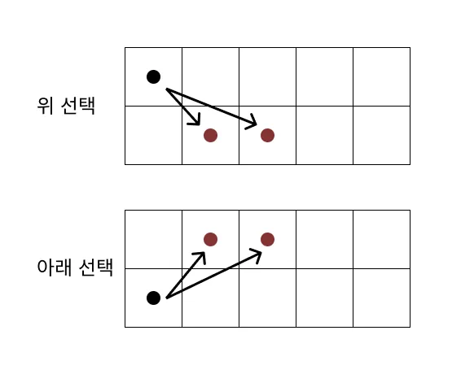
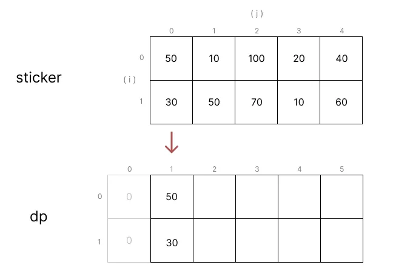
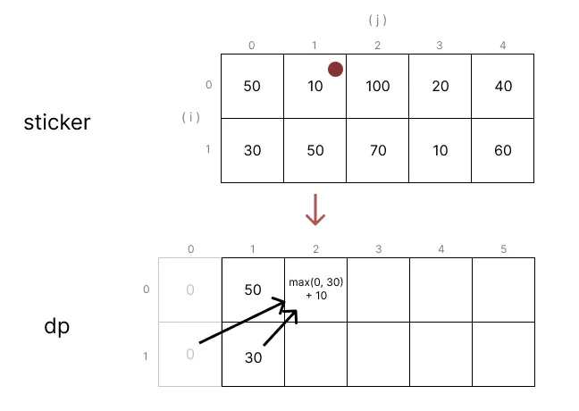
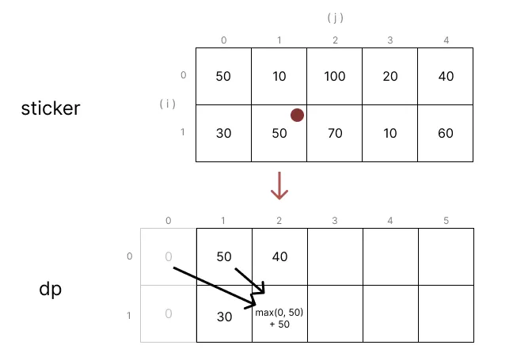
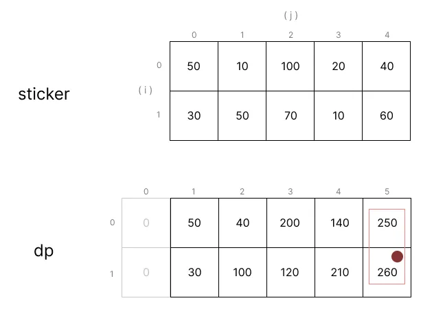

## 문제

https://www.acmicpc.net/problem/9465

## 접근 방법

하나의 스티커를 선택했을 때, 그 다음 스티커를 고를 수 있는 방법은 두 가지로 정해진다.

- 대각선으로 한칸 옆
- 대각선으로 두칸 옆



세칸, 네칸 이상으로 더 옆의 스티커를 선택할 수도 있으나, 그러한 경우는 그 사이에 있는 스티커를 더 선택할 수 있으므로 고려하지 않는다.

---

나도 여기까지는 생각은 했으나.. 스티커를 선택할 수 있는 경우의 수를 DFS로 모두 돌면서 최대 점수를 계산했기 때문에 시간 초과가 날 수 밖에 없었다.

## DFS (시간초과)

<div class="code-header">
	<span class="red btn"></span>
	<span class="yellow btn"></span>
	<span class="green btn"></span>
</div>

```js
let result = '';

while (testCases) {
  let answer = 0;

  const dfs = (rowIdx, depth, score) => {
    if (depth >= length) {
      answer = Math.max(answer, score);
      return;
    }

    if (rowIdx === 0) {
      dfs(1, depth + 1, score + stickers[rowIdx][depth]);
      dfs(1, depth + 2, score + stickers[rowIdx][depth]);
    } else {
      dfs(0, depth + 1, score + stickers[rowIdx][depth]);
      dfs(0, depth + 2, score + stickers[rowIdx][depth]);
    }
  };

  for (let i = 0; i <= 1; i++) {
    dfs(i, 0, 0);
  }

  result += `${answer}\n`;
}

console.log(result);
```

## DP

이 문제는 DP를 활용해서 풀어야 하는 문제였으며, 아주 간단하게 풀 수 있었다.

이전 DFS 풀이에서는 현재 선택한 스티커를 기준으로 다음에 선택할수 있는 스티커의 경우를 계속해서 탐색하여 최대 점수를 계산하는 방식이었지만,   
DP를 활용한 풀이는 현재 스티커를 기준으로 **이전에 선택 가능했던 스티커들**의 최대 점수를 계산하는 방식이다.



여기서 `DP[i][j]`은 세로 i, 가로 (j + 1) 번째 스티커를 선택했을 때 까지의 점수의 최대값을 나타낸다.   
먼저 `DP[i][0]` 은 모두 0으로 채우고, `DP[i][1]` 은 첫번째 스티커만 고려하면 되므로 `sticker[i][0]` 값을 채워준다.





그 다음 `DP[i][2]` 부터는, 대각선으로 두 칸 전의 dp값과 한 칸 전의 dp 값 중 더 큰 것에 현재 sticker 를 더한 값을 넣는다.

이런 식으로 DP 배열의 끝까지 채우고 나서, DP 배열의 마지막 줄의 위 아래 값중 더 큰 값을 리턴하면 그것이 전체 스티커에서 최대로 얻을수 있는 점수가 된다.



javascript 코드로 풀면 다음과 같다.

<div class="code-header">
	<span class="red btn"></span>
	<span class="yellow btn"></span>
	<span class="green btn"></span>
</div>

```js
let result = '';

while (testCases) {
  const dp = [
    [0, stickers[0][0]],
    [0, stickers[1][0]],
  ];
  for (let i = 2; i <= length; i++) {
    dp[0][i] = Math.max(dp[1][i - 1], dp[1][i - 2]) + stickers[0][i - 1];
    dp[1][i] = Math.max(dp[0][i - 1], dp[0][i - 2]) + stickers[1][i - 1];
  }

  result += `${Math.max(dp[0][length], dp[1][length])}\n`;
}

console.log(result);
```

<small>DP 문제는 항상 풀 때마다 해답을 생각하는건 어려운데 막상 코드는 너무 간단해서 좀 허무한 느낌이 든다..</small>