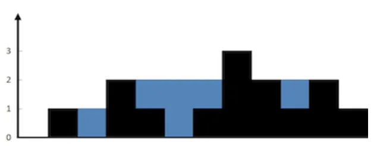

## 문제

> **Given n non-negative integers representing an elevation map where the width of each bar is 1, compute how much water it can trap after raining.** <br> <small>너비가 1인 막대 n개의 높이를 표시한 지도가 주어졌을 때, 비가 내린 후 얼마나 많은 물을 가둘 수 있는지 계산할 것!</small>

- 예시 1



```txt
Input: height = [0,1,0,2,1,0,1,3,2,1,2,1]

Output: 6

Explanation: The above elevation map (black section) is represented by array [0,1,0,2,1,0,1,3,2,1,2,1]. In this case, 6 units of rain water (blue section) are being trapped.
```

- 예시 2

```txt
Input: height = [4,2,0,3,2,5]

Output: 9
```

- 제약조건
	- n == height.length
	- 1 <= n <= 2 * 104
	- 0 <= height[i] <= 105

## 나의 풀이

<small>> Runtime 212ms (beats 21.26%)</small><br>
<small>> Memory 45.5MB (beats 63.22%)</small>

물을 가둘 수 있으려면 높은 봉우리가 양쪽에 있어야 하며,   
내 코드에선 그중 왼쪽 봉우리를 peak, 오른쪽 봉우리를 nextPeak 라고 지칭했다.

- 탐색 순서는 왼쪽에서 오른쪽
- 먼저 peak를 정한 다음, peak보다 높이가 크거나 같은 가장 가까운 봉우리를 nextPeak로 지정
	- **peak 보다 크거나 같은 nextPeak 가 존재할때**: <br>peak부터 nextPeak 사이의 모든 i에 대해 `height[peak] - height[i]` 값을 정답에 더함 <br><small>(왼쪽 봉우리가 오른쪽 봉우리보다 작으니까 왼쪽을 기준으로 물 높이를 계산한 것)</small>
	- **peak 보다 크거나 같은것이 존재하지 않을때**: <br>이후에 있는 봉우리들 중 그나마 가장 큰 것(maybePeak)을 nextPeak으로 지정함. 그리고 peak부터 nextPeak 사이의 모든 i에 대해 `height[nextPeak] - height[i]` 값을 정답에 더함 <br><small>(오른쪽 봉우리가 왼쪽 봉우리보다 작으므로 오른쪽을 기준으로 물 높이를 계산한 것)</small>
- nextPeak에 도달하면 peak를 nextPeak로 갱신하고, 다시 nextPeak를 찾음
- 끝에 도달할 때까지 반복

<div class="code-header">
	<span class="red btn"></span>
	<span class="yellow btn"></span>
	<span class="green btn"></span>
</div>

```ts
function trap(height: number[]): number {
  let answer = 0;
  let peak = 0;
  let nextPeak = 0;
  let isReverse = false;

  for (let i = 0; i < height.length; i++) {
    if (i >= nextPeak) {
      peak = nextPeak;
      let max = 0;
      let maybePeak = 0;
      for (let j = i + 1; j < height.length; j++) {
        if (height[j] >= height[peak]) {
          nextPeak = j;
          isReverse = false;
          break;
        }
        if (height[j] > max) {
          maybePeak = j;
          max = height[j];
        }
      }
      if (peak === nextPeak) {
        nextPeak = maybePeak;
        isReverse = true;
      }
    } else {
      if (isReverse) answer += height[nextPeak] - height[i];
      else answer += height[peak] - height[i];
    }
  }

  return answer;
}
```

## 더 좋은 풀이법 (투포인터)

<small>> Runtime 75ms (beats 61.61%)</small><br>
<small>> Memory 45.5MB (beats 70.38%)</small>

리스트의 맨 처음과 맨 끝을 가리키는 두개의 포인터를 활용하는 방법이다.

- 왼쪽 포인터: 0, 오른쪽 포인터: length - 1 로 초기화
- 양쪽 포인터가 각각 maxHeight 변수를 가짐
- 두개의 포인터를 비교해서, height가 더 작은 쪽이 점점 가운데로 가까워지며 빗물을 더하는 방식
- maxHeight를 현재 height와 비교하여 갱신하고, (maxHeight - height) 값을 정답에 더함
- 양쪽 포인터가 만날 때까지 반복

이 방식으로 하면 O(n) 으로 해결할 수 있다.

<div class="code-header">
	<span class="red btn"></span>
	<span class="yellow btn"></span>
	<span class="green btn"></span>
</div>

```ts
function trap(height: number[]): number {
  let answer = 0;
  let left = 0;
  let right = height.length - 1;
  let leftMax = 0,
    rightMax = 0;

  while (left < right) {
    if (height[left] <= height[right]) {
      leftMax = Math.max(leftMax, height[left]);
      answer += leftMax - height[left];
      left++;
    } else {
      rightMax = Math.max(rightMax, height[right]);
      answer += rightMax - height[right];
      right--;
    }
  }

  return answer;
}
```