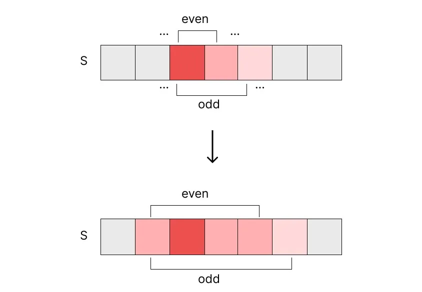
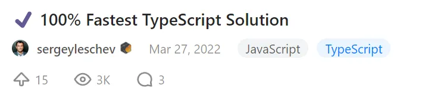

## 문제

> **Given a string s, return the longest palindromic substring in s.** <br> <small>s 라는 문자열이 주어졌을 때, 가장 긴 palindrome을 리턴할 것!</small> <br> <small>( palindrome: 앞에서부터 읽으나 뒤에서부터 읽으나 똑같은 문자열 )</small>

- 예시 1

```txt
Input: s = "babad"

Output: "bab"

Explanation: "aba" is also a valid answer.
```

- 예시 2

```txt
Input: s = "cbbd"

Output: "bb"
```

- 제약조건
	- 1 <= s.length <= 1000
	- s 는 영문과 숫자로만 이루어짐

## 풀이 1 (오답)

처음에 내가 시도했던 방법으로, palindrome은 반드시 첫 글자와 마지막 글자가 동일하다는 것을 활용했다.

1. 동일한 문자가 두번 이상 나타나는 경우가 있는지 찾음 (없으면 그냥 첫번째 문자를 리턴)
2. 1번에 해당하는 문자들 중 첫 인덱스를 startIdx 로 지정
3. startIdx 위치의 문자와 동일한 문자를 맨 끝에서부터 찾아서 endIdx로 지정
4. 양 끝 (startIdx ~ endIdx) 에서부터 안쪽으로 비교해가며 글자 쌍이 동일한지 확인
5. 모두 동일하면 substring을 리턴
6. 동일하지 않으면 양 끝 지점(startIdx, endIdx)을 안쪽으로 하나씩 좁혀가며 다시 비교를 반복

<div class="code-header">
	<span class="red btn"></span>
	<span class="yellow btn"></span>
	<span class="green btn"></span>
</div>

```ts
function longestPalindrome(s: string): string {
    let startIdx = s.search(/(.).*\1/g);
    if (startIdx === -1) return s[0];

    let endIdx = s.lastIndexOf(s[startIdx]);
    while (startIdx <= endIdx) {
        let isPalindromic = true;
        for (let i = startIdx, j = endIdx; i <= j; i++, j--) {
            if (s[i] !== s[j]) {
                isPalindromic = false;
                break;
            }
        }
        if (isPalindromic) return s.substring(startIdx, endIdx + 1);

        endIdx = s.lastIndexOf(s[startIdx], endIdx - 1);
        while (endIdx === -1 && startIdx < endIdx) {
            startIdx++;
            endIdx = s.lastIndexOf(s[startIdx], endIdx - 1);
        }
    }
};
```

여기서 틀린 이유로 생각되는 부분은,   
6번 과정에서 양 끝점을 좁혀갈 때 시작 인덱스만을 기준으로 해서 범위를 좁혀갔기 때문이다.   
위와 같이 풀면 `aacabdkacaa` 에서 `aca` 가 아닌 `aa` 를 반환하게 된다.

그런데 그 문제를 해결하기 위해 양 끝점을 모두 고려해서 범위를 좁히려면 시간 복잡도가 O(n^2) 을 넘어갈 것 같아서 다른 풀이법을 찾아야만 했다.

## 풀이 2 (정답)

'파이썬 알고리즘 인터뷰' 책에 기술되어 있는 풀이법으로, 시간 복잡도는 O(n^2) 이다.

짝수 개수인 palindrome과 홀수 개수인 palindrome을 각각 판별하며, 가장 긴 부분 문자열을 찾기 위해 양 끝 점을 동일하게 확장시키는 방식이다.



1. S 문자열의 0번째 인덱스부터 length - 1 인덱스까지 기준점(i)을 옮겨가며 반복
2. 각 반복문에서, 처음엔 짝수 포인터는 [i, i+1], 홀수 포인터는 [i, i+2]로 시작점과 끝점을 지정함
3. 시작점과 끝점의 문자가 동일하면, 양 끝점을 동시에 1씩 확장시킴
4. 양 끝점이 동일하면 계속해서 확장시킴 (문자열을 벗어나지 않는 범위에서)
5. 확장이 끝나면 양 끝점 간의 substring 과 이전까지의 최대 palindrome 을 비교해서, 더 긴 값을 정답으로 교체

<div class="code-header">
	<span class="red btn"></span>
	<span class="yellow btn"></span>
	<span class="green btn"></span>
</div>

```ts
// Beats: Runtime 71.32%, Memory 77.92%

function longestPalindrome(s: string): string {
    if (s.length === 1) return s;
    let res = s[0];
    
    for (let i = 0; i < s.length - 1; i++) {
        let evenLeft = i, evenRight = i + 1;
        let oddLeft = i, oddRight = i + 2;
        
        while (s[evenLeft] === s[evenRight]) {
            evenLeft--;
            evenRight++;
            if (evenLeft < 0 || evenRight >= s.length) break;
        }

        while (s[oddLeft] === s[oddRight]) {
            oddLeft--;
            oddRight++;
            if (oddLeft < 0 || oddRight >= s.length) break;
        }

        evenLeft++;
        evenRight--;
        oddLeft++;
        oddRight--;

        if (evenRight - evenLeft + 1 > res.length) res = s.slice(evenLeft, evenRight + 1);
        if (oddRight - oddLeft + 1 > res.length) res = s.slice(oddLeft, oddRight + 1);
    }
    return res;
```

## 풀이 3 (정답 + 리팩터링)

위의 코드를 리팩터링한 것으로,
중복되는 로직을 함수로 빼내고 while문 내부의 조건절을 while문 자체의 반복 조건으로 바꾸어서 코드의 길이를 줄였다.

리트코드에 TypeScript Solution 으로 올라온 것 중 가장 인기 있는 해답을 참고했다.



<div class="code-header">
	<span class="red btn"></span>
	<span class="yellow btn"></span>
	<span class="green btn"></span>
</div>

```ts
// Beats: Runtime 68.36%, Memory 66.35%

function longestPalindrome(s: string): string {
    if (s.length === 1) return s;
    let res = s[0];
    
    for (let i = 0; i < s.length - 1; i++) {
        const even = getPalindrome(i, i + 1, s);
        const odd = getPalindrome(i, i + 2, s);

        if (even.length > res.length) res = even;
        if (odd.length > res.length) res = odd;
    }

    return res;
}

function getPalindrome(left: number, right:number, s: string): string {
    while (left >= 0 && right <= s.length && s[left] === s[right]) {
        left--;
        right++;
    }
    return s.substring(left + 1, right);
}
```