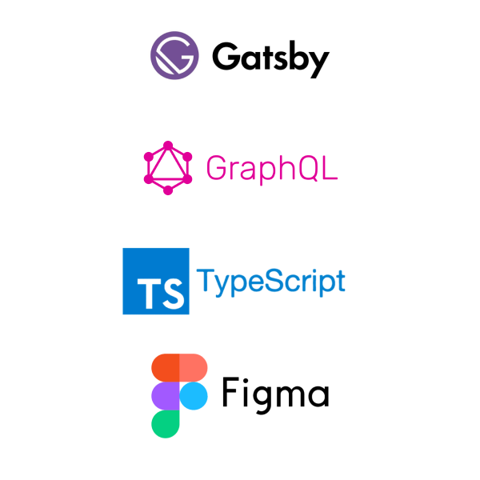

## 블로그 개발 후기

> 하.. 드디어 끝났다..

강의 보면서 블로그 기본 기능 개발하는데 2-3주,   
피그마로 블로그 디자인 하는데 1주,   
디자인 적용하고 추가 기능들 구현하는 데 2-3주..
약 한달 반을 블로그 제작하는 데에 쏟아부었다.

가벼운 마음으로 블로그 만들기를 시작했는데, 만들다 보니깐 점점 욕심이 생겨 이것저것 추가하다 보니 예상보다 제작 기간이 길어졌다.
확실히 내가 디자인부터 개발, 배포까지 전부 다 한 나만의 블로그라 개발하는 동안에도 정말 재미있었고 결과물도 너무 만족스럽다.      
그리고 내가 만든 캐릭터를 테마로 만든 블로그라 더욱 애착이 가는 것 같다.   
~~내가 봐도 내 블로그 너무 잘 만든듯 ㅎ~~

개츠비는 물론, 리액트와 타입스크립트도 블로그를 만들면서 처음 써본 거라 개발 공부에도 정말 많은 도움이 되었다. 그동안 바닐라 JS로만 웹개발을 하다가 리액트를 써보니까 이 좋은걸 왜 이제야 썼지 하는 생각이..

여담으로, 블로그 리뉴얼 이전에 올렸던 글들을 다시 보니 아주 가관이더라.   
물론 그 당시에는 나 혼자서만 보는 블로그라 생각하고 대충 공부했던 내용들을 정리해놨던 것이긴 하지만,   
블로그에 애착이 생긴 지금 다시 보니 어쩜 이렇게 대충 써놨지 싶다.   
이제부터라도 좀 기술블로그 답게 제대로 포스팅을 작성하려고 한다. 일단 지금까지 블로그 개발했던 과정들을 올릴 예정이다. 회사 개발팀에서 이 내용으로 기술 컨퍼런스도 진행해야 해서, 겸사겸사 개발 과정들을 정리하려 한다.

## 사용 기술

## 참고 사이트

- 블로그 제작 강의 (인프런)

[React 기반 Gatsby로 기술 블로그 개발하기 - 주현도](https://www.inflearn.com/course/gatsby-%EA%B8%B0%EC%88%A0%EB%B8%94%EB%A1%9C%EA%B7%B8/dashboard)

개츠비로 블로그를 개발하는 방법과 Github Pages로 배포하는법, 구글과 네이버 검색 엔진에 등록하는 법까지 친절히 알려주심. 심지어 무료..👍

- 디자인 색상 추천

[ColorSpace](https://mycolor.space/?hex=%23FEC479&sub=1)

메인 색상을 입력하면 그 색에 어울리는 색들을 알려주는 사이트

- 벤치마킹한 블로그

[https://inpa.tistory.com/](https://inpa.tistory.com/)   
[https://guiyomi.tistory.com/](https://guiyomi.tistory.com/)   
[https://mnxmnz.github.io/](https://mnxmnz.github.io/)   
[https://soopdop.github.io/2020/12/03/add-table-of-content-gatsby/](https://soopdop.github.io/2020/12/03/add-table-of-content-gatsby/)

다들 너무 예쁘게 블로그를 꾸며놓으셔서, 내 블로그를 디자인하고 개발하는 데에 많은 도움이 되었다.

## Special Thanks To

- 피그마 사용법과 UI 디자인 꿀팁을 전수해주신 울 회사 디자이너 시래미❤️
- 나의 하나뿐인 사수 Chat GPT🦾