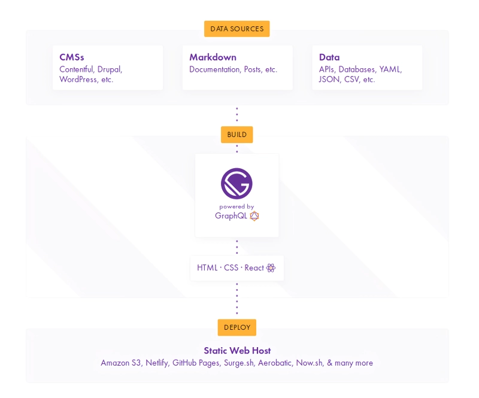
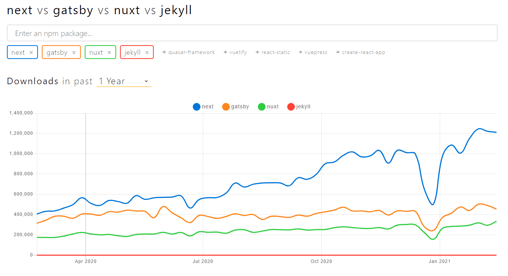
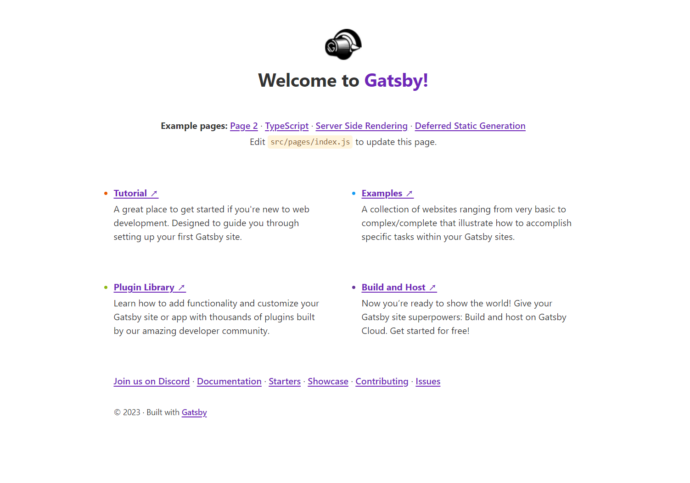

## Gatsby란?


~~이분 얘기하는거 아닙니다.~~

### 개념

[React](https://ko.reactjs.org/) 와 [GraphQL](https://kotlinworld.com/330) 을 기반으로 만들어진 프레임워크이며, [JAM Stack](https://mnxmnz.github.io/gatsby/what-is-gatsby/) 을 활용한 **정적 사이트 생성기**이다.

### 동작 방식



1. Markdown, Api 등 다양한 데이터 소스에서 데이터를 가져온다.
2. React 를 이용해서 컴포넌트를 작성하듯이 웹사이트를 만든다.
3. 빌드할 때 모든 데이터를 가져와서 정적 파일을 생성하고, 빌드된 배포 파일에 포함시킨다.

Gatsby는 리액트 기반이지만, JavaScript가 실행되면 빈 HTML 페이지 안에 마크업을 추가해주는 SPA와 달리, 개발 후 빌드 과정에서 페이지 내의 모든 콘텐츠가 생성된 채 배포되기 때문에 **SEO**를 챙기기 좋다.

또한 필요에 따라 **CSR 과 SSR, lazy loading** 을 적절히 섞어 사용할 수 있어 성능 면에서도 단순 정적 페이지보다 큰 장점이 있다.

### Gatsby로 블로그를 만든 이유



위는 2021년까지의 대표적인 JAM Stack 기반 프레임워크 4가지의 다운로드 횟수를 나타낸 것이다. 여기서는 Next.js 의 다운로드 수가 가장 많고 Gatsby 가 그 다음으로 많았다.   
둘 다 React 기반의 프레임워크인데, Next.js 를 쓰지 않고 Gatsby 를 쓴 이유는 두 프레임워크의 사용 용도가 다르기 때문이다.

> Next.js 는 정적 사이트 생성의 기능도 있지만 주로 <strong>서버 사이드 렌더링</strong>을 위해 사용하는 프레임워크이다. 즉, 서버와 통신을 하며 요청을 받을 때마다 동적으로 웹 사이트를 생성한다.

> Gatysby 는 서버 없이 오로지 <strong>정적 사이트 생성</strong>을 위해 사용하는 프레임워크이다. 그래서 서비스 및 기업 소개 페이지, 블로그, 포트폴리오 등에 많이 사용된다.

## Gatsby 프로젝트 생성하기

아래 명령어 입력 시 개츠비 프로젝트가 새로 생성된다.

```bash
npx gatsby-cli new "[프로젝트명]"
```

생성된 프로젝트로 이동해서 아래 명령어를 입력하면 로컬 서버가 실행되고, 기본 메인페이지를 확인할 수 있다.

```bash
gatsby develop
# yarn develop 도 가능
```

아래와 같이 뜬다면 성공적으로 실행된 것이다.

```bash
You can now view gatsby-starter-default in the browser.

http://localhost:8000/

View GraphiQL, an in-browser IDE, to explore your site's data and schema

http://localhost:8000/___graphql

Note that the development build is not optimized.
To create a production build, use gatsby build
```

실행 화면



다음 포스팅에선 완성된 블로그의 프로젝트 구조를 분석하고,   
개츠비에 타입스크립트를 적용하는 방법에 대해 다룰 것이다.

---

#### 참고 링크

[Deeming - Gatsby는 처음이라 :: 개념부터 프로젝트 시작까지](https://mnxmnz.github.io/gatsby/what-is-gatsby/)   
[Dev World - GraphQl이란 무엇인가?](https://kotlinworld.com/330)