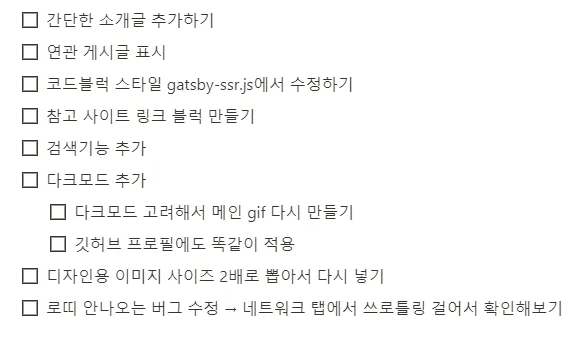

## 들어가며

[기술블로그 개발일지 2편](https://cheeseb.github.io/blog/github-blog-with-gatsby-ts-project-structure-and-setting/)을 작성한지 8개월이 지났다..
어떻게 만들었는지는 까먹은지 오래고, 추가 기능과 고칠 부분들은 정리만 해놓고 방치되었다🥲

작성한지 오래인 투두리스트

핑계를 대자면 그동안 회사에 있을때도, 퇴사한 후에도 이것저것 일이 많아서 계속 미뤄놓고 있다가 결국 코드를 다 까먹어서 다시 작성할 엄두를 못 내고 있었다..   
그러다 현재 참여하고 있는 코드잇 스프린트 부트캠프에서 블로그 개발 스터디를 하게 되어서 다시 개발일지를 마저 작성하려고 한다.

이 게시글은 본격적으로 개발일지를 작성하기 전, 어떤 작업을 했는지 정리해 보려고 올리는 글이다. 아직 개발일지를 다 작성하지 않은 지금은 내가 어떤 글을 쓸지 계획할 용도이고, 다 작성한 후에는 목차의 역할을 하게 될 것이다.

## 작업 내용

<small>디자인에 관한 내용은 최대한 배제하고 개발 과정에 대해서만 정리했다.</small>

1. **Gatsby 개념 공부와 프로젝트 생성 ([링크](https://cheeseb.github.io/blog/github-blog-with-gatsby-ts-basic/))**
2. **프로젝트 초기 세팅 및 폴더구조 정리 ([링크](https://cheeseb.github.io/blog/github-blog-with-gatsby-ts-project-structure-and-setting/))**
3. **헤더와 사이드바**
    - 프로필 영역 / 카테고리 내비게이션
4. **메인페이지**
    - 이미지 배너 / 게시글 목록
5. **게시글 상세페이지**
    - 상단 헤더 / 컨텐츠 / 목차
    - 댓글 라이브러리
6. **SEO**
    - Meta Tag / Canonical Link Element
    - Sitemap / robots.txt
    - Google Search Console / Google Analytics
7. **그외 작업사항**
    - 404 에러페이지
    - Github Pages 배포

---

만들 당시에는 뭔가 이것저것 많이 했던 것 같은데, 막상 정리하고 보니 별 건 없어 보인다.

사실 오래전에 개발했던 블로그에 대해 이렇게 개발 일지를 마저 작성하는 게 과연 의미가 있을까 하는 생각도 들었지만, 앞으로 블로그에 추가하고 보완할 부분들도 많은데 기존에 작성한 코드를 이해하고 있어야 하는 건 당연하기 때문에 어차피 코드 분석도 할 겸 개발 일지로 정리해 놓기로 했다.