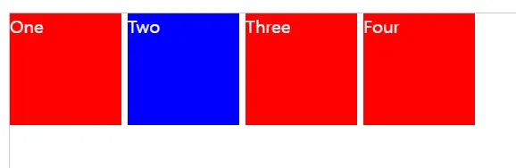
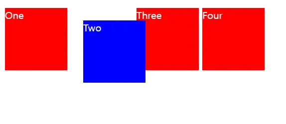
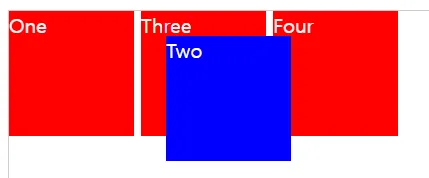
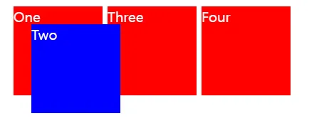
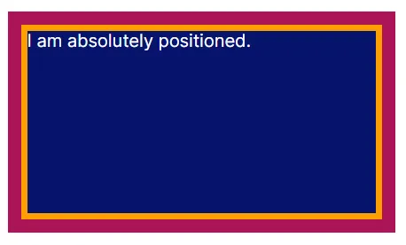
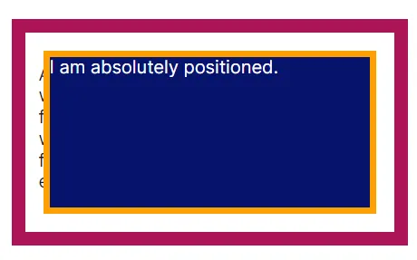

## CSS의 Position 종류

position 속성은 문서 상에 요소를 배치하는 방법을 지정하며, 종류는 아래와 같다.

- static (default)
- relative
- absolute
- fixed
- sticky

## static

- 배치 기준: 원래 있어야 할 위치
- 위치 조정 (top, right, bottom, left): 적용 불가

기본으로 설정되는 값이며, HTML에 작성된 순서 그대로 원래 있어야 하는 위치에 배치된다.   
top, right, bottom, left 속성 뿐 아니라 z-index 속성도 아무 영향을 주지 못한다.

<div class="code-header">
	<span class="red btn"></span>
	<span class="yellow btn"></span>
	<span class="green btn"></span>
</div>

```css
.box {
  display: inline-block;
  width: 100px;
  height: 100px;
  background: red;
  color: white;
}

#two {
  /* position: static; */
  top: 20px;
  left: 20px;
  background: blue;
}
```



<div class="source">출처: https://developer.mozilla.org/ko/docs/Web/CSS/position</div>

## relative

- 배치 기준: 원래 있어야 할 위치
- 위치 조정 (top, right, bottom, left): 적용 가능

static처럼 원래 있어야 할 위치를 기준으로 배치가 되지만, 그 상태에서 위치를 조정할 수 있다.   
위치가 조정되어도 원래 있었던 곳의 공간은 그대로 차지한다.

<div class="code-header">
	<span class="red btn"></span>
	<span class="yellow btn"></span>
	<span class="green btn"></span>
</div>

```css
#two {
  position: relative;
  top: 20p
  left: 20px;
  background: blue;
}
```



<div class="source">출처: https://developer.mozilla.org/ko/docs/Web/CSS/position</div>

## absolute

- 배치 기준: 상위 요소 중 static이 아닌 요소 or 최상위 요소
- 위치 조정 (top, right, bottom, left): 적용 가능

상위 요소들 중 static 속성이 아닌 가장 가까운 요소를 기준으로 배치된다. static 속성이 아닌 요소가 존재하지 않는다면 최상위 요소인 \<body\>를 기준으로 배치된다.

기존 배치에서 아예 빠져버리기 때문에, 너비를 따로 지정해두지 않으면 기본적으로 내부 콘텐츠만큼의 너비를 가진다. 그래서 내부 요소도 없고 너비 지정도 되어있지 않으면 화면에 보이지 않으므로 따로 너비 지정을 해주거나 left, right 속성을 둘다 지정해주면 그 사이 간격만큼 너비가 생긴다.

- static이 아닌 상위 요소가 존재할 때

<div class="code-header">
	<span class="red btn"></span>
	<span class="yellow btn"></span>
	<span class="green btn"></span>
</div>

```html
<div class="box" id="one">One</div>
<div class="container">
  <div class="box" id="two">Two</div>
  <div class="box" id="three">Three</div>
</div>
<div class="box" id="four">Four</div>

```

<div class="code-header">
	<span class="red btn"></span>
	<span class="yellow btn"></span>
	<span class="green btn"></span>
</div>

```css
.container {
  display: inline-block;
  position: relative;
}

#two {
  position: absolute;
  top: 20px;
  left: 20px;
  background: blue;
}
```



<div class="source">출처: https://developer.mozilla.org/ko/docs/Web/CSS/position</div>

- static이 아닌 상위 요소가 존재하지 않을 때

<div class="code-header">
	<span class="red btn"></span>
	<span class="yellow btn"></span>
	<span class="green btn"></span>
</div>

```html
<body>
	<div class="box" id="one">One</div>
	<div class="box" id="two">Two</div>
	<div class="box" id="three">Three</div>
	<div class="box" id="four">Four</div>
</body>
```

<div class="code-header">
	<span class="red btn"></span>
	<span class="yellow btn"></span>
	<span class="green btn"></span>
</div>

```css
#two {
  position: absolute;
  top: 20px;
  left: 20px;
  background: blue;
}
```



<div class="source">출처: https://developer.mozilla.org/ko/docs/Web/CSS/position</div>

## fixed

- 배치 기준: 뷰포트 (브라우저 전체화면)
- 위치 조정 (top, right, bottom, left): 적용 가능

요소를 화면의 특정 부분에 고정시키고 싶을 때 사용한다. 
사용자에게 보이는 화면을 기준으로 배치되기 때문에, 스크롤해도 밀려나지 않는다.

absolute와 동일하게 기존 배치에서 아예 빠져서 내부 콘텐츠만큼의 너비만 가지므로, 따로 width를 지정하거나 left, right 속성을 둘다 지정해주어야 너비가 생긴다.

<div class="code-header">
	<span class="red btn"></span>
	<span class="yellow btn"></span>
	<span class="green btn"></span>
</div>

```css
div {
	position: fixed;
	width: 100px;
	height: 30px;
	padding: 2px 6px;
	background-color: #ff8982;
	bottom: 20px;
	right: 20px;
	font-size: 12px
}
```

> 이 페이지의 오른쪽 하단에 계속 붙어있는 친구가 위 예시 코드의 결과입니다.

<div style="width: 100px; height: 30px; padding: 2px 6px; background-color: #ff8982; position: fixed; bottom: 20px; right: 20px; font-size: 12px">fixed 예시입니당</div>

## sticky

- 배치 기준: 원래 있어야 할 위치
- 위치 조정 (top, right, bottom, left): 필수 적용

스크롤이 가능한 부모 요소 안에 있는 특정 요소가 스크롤에 밀려나지 않도록 하기 위해 사용한다.   
초기에는 static처럼 일반적인 문서 흐름대로 위치해 있다가, 스크롤이 지정된 위치(top, right, bottom, left로 지정해둔 위치)에 도달하면 그 자리에 fixed처럼 고정된다.   
다만 브라우저를 기준으로 고정되는 fixed와 달리, sticky 요소는 부모 요소의 내부에서만 고정되므로, 화면 전체가 스크롤되어 부모 요소가 밀려나면 그 안의 sticky 또한 밀려나게 된다.

sticky 요소에서의 top, right, bottom, left 속성은 처음부터 적용되는 것이 아닌, 스크롤 시 고정될 위치를 지정해준다. top과 bottom은 아래로 스크롤했을 때, right와 left는 좌우로 스크롤했을 때 동작한다.

<div class="code-header">
	<span class="red btn"></span>
	<span class="yellow btn"></span>
	<span class="green btn"></span>
</div>

```html
<div class="wrapper">
	<div class="container">
		<div class="static"></div>   
		<div class="sticky">sticky</div>     
	</div>
</div>
```

<div class="code-header">
	<span class="red btn"></span>
	<span class="yellow btn"></span>
	<span class="green btn"></span>
</div>

```css
.wrapper {
	width: 200px;
	height: 200px;
	border: 2px solid;
	overflow: auto;
}

.container {
	width: 400px;
	height: 400px;
}

.static {
	display: inline-block;
	width: 60px; height: 100px;
	background-color: skyblue
}

/* sticky 에 top 20, left 20 적용 */

.sticky {
	position: sticky;
	top: 20px;
	left: 20px;
	display: inline-block;
	padding: 6px;
	background: #ff8982;
}
```

<div style="width: 200px; height: 200px; border: 2px solid; overflow: auto">
	<div style="height: 400px; width: 400px;">
		<div style="display: inline-block; width: 60px; height: 100px; background-color: skyblue"></div>   
		<div style="display: inline-block; padding: 6px; position: sticky; top: 20px; left: 20px; background: #ff8982;">sticky</div>     
	</div>
</div>

---

## inset 속성

> top, right, bottom, left 순서대로 위치를 지정하는 축약식 속성

inset은 top, right, bottom, left 속성을 한번에 지정할 수 있도록 하는 속성이다.   
margin, padding과 마찬가지로 _상우하좌, 상하/좌우, 상/좌우/하, 상/우/하/좌_ 네가지 방법으로 정의가 가능하다.

```css
{
	position: absolute;

	inset: 10px; /* all edges */
	inset: 4px 8px; /* top,bottom left,right */
	inset: 5px 15px 10px; /* top left,right bottom */
	inset: 2.4em 3em 3em 3em; /* top right bottom left */
}
```

absolute 속성에서 left, right 속성을 둘 다 지정하면 그 사이 간격만큼 너비가 생기는데 (top, bottom 사이에도 동일하게 높이가 생김), 이걸 이용해서 자식 요소가 부모에 꽉 차게 덮어버리도록 하고 싶으면 top, right, bottom, left를 모두 0으로 주면 되며, **이것을 간단하게 `inset: 0;` 으로 해결 가능하다.**



<div class="source">출처: https://developer.mozilla.org/ko/docs/Web/CSS/position</div>

만약 꽉 차게 하는것이 아닌, 조금 여백을 두고 가운데에 위치하도록 하고 싶으면 `inset: 10px`처럼 간격을 주면 된다.



<div class="source">출처: https://developer.mozilla.org/ko/docs/Web/CSS/position</div>

## 참고 자료

- [MDN - position](https://developer.mozilla.org/ko/docs/Web/CSS/position)
- [DaleSeo - CSS의 position 속성으로 HTML 요소 배치하기](https://www.daleseo.com/css-position/)
- [코딩팩토리 - [CSS] position : sticky 속성 - 요소를 스크롤에 따라오게 만들기](https://coding-factory.tistory.com/951)