## 무슨 이슈였나

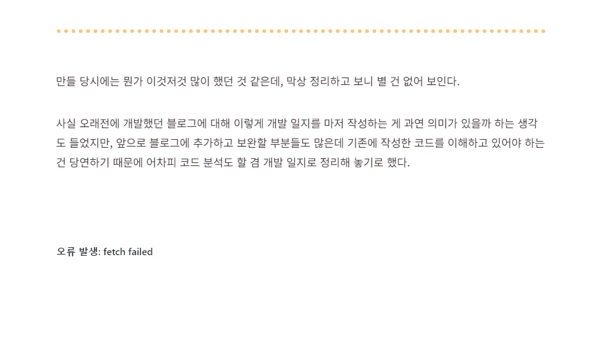

게시글인 척 하는 에러메세지

[이전 게시글](https://cheeseb.github.io/blog/github-blog-with-gatsby-ts-index/) 작성을 끝내고 나서 게시글을 확인하니, 난데없이 밑에 `오류 발생:fetch failed` 라는 문구가 생겼다. 마치 게시글의 일부인 것 마냥 자연스럽게 적혀있어서 '내가 저런걸 적었던가..?' 하고 마크다운을 다시 확인했는데 당연히 저런게 있을리는 없었다.

뭔가 허전해서 잘 살펴보니 원래 저 자리에 있었던 댓글 라이브러리인 [Giscus](https://giscus.app)에서 오류가 발생한 것이었다.

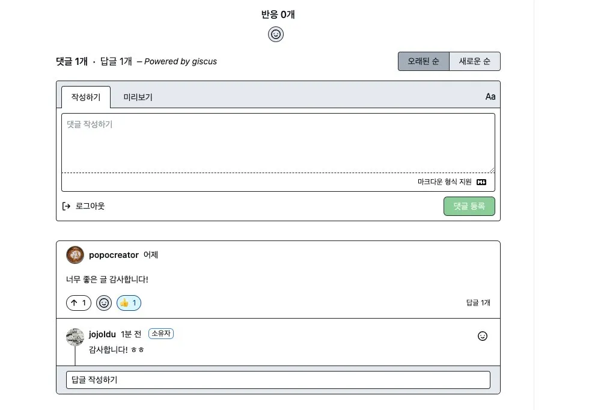

원래는 이렇게 댓글창 떠야됨 (출처: https://jojoldu.tistory.com/704)

처음엔 라이브러리가 업데이트 되었다거나 하는 이유로, 코드를 수정해서 다시 적용해야 하는건가 싶었지만 그런건 아니었다. 검색해봐도 딱히 나오는건 없어서 에러 메세지에 나온 대로 [이슈 페이지](https://github.com/giscus/giscus/issues)에 들어가 보았더니 다행히도 [동일한 문제에 대해서 이슈](https://github.com/giscus/giscus/issues/1250)를 올린 분이 있었다.

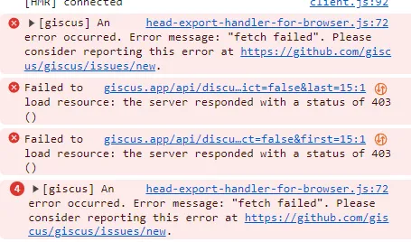

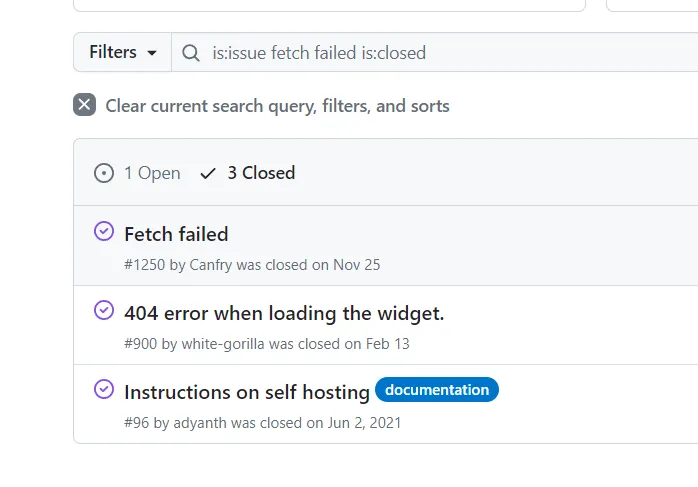

Open상태의 이슈 1개는 내가 올린거임

이슈에 올라온 개발자의 메세지를 번역하니 다음과 같았다.

> _토큰을 캐시하는 데 사용하는 컴퓨팅 인스턴스가 어떤 이유로 오늘 아침 응답하지 않게 되었습니다. 새 서비스를 만들고 서비스 경로를 다시 지정했습니다. 이제 괜찮을 것입니다. 신고해 주셔서 감사합니다   - laymonage_

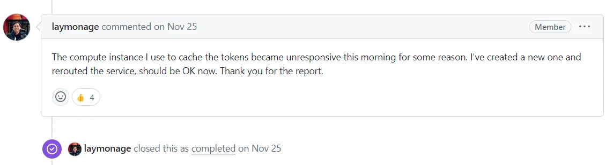

그렇다.. 이건 나의 개발 실수도, 라이브러리 업데이트도 아닌 라이브러리 자체에 오류가 발생한 것이었다.   
지금껏 개발을 하면서 이런 경우는 처음이었기에 라이브러리 자체에 문제가 있을 거라고는 생각도 못하고 있었다. 이 이슈를 보기 전까지는 말이다.

## 새로운 이슈를 올린 이유

> Happened again..!

여기서 매우 반가웠던 점이, 내가 이 이슈를 읽기 8분 전에 동일한 이슈가 다시 발생했다고 댓글을 남긴 분이 있었다는 것이다.

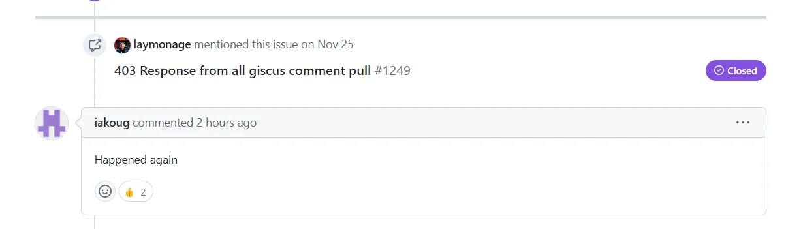

캡처를 나중에 해서 2시간 전으로 나오지만, 이슈를 확인했을 당시엔 8분 전으로 떴었다

여기에 댓글이 달렸으니 개발자님이 고쳐주시겠지 하고 넘어가려 했으나, 문득 closed된 이슈에는 댓글을 달아도 메일이 오지 않았던 게 생각이 났다.   
그래서 차라리 이 이슈를 멘션한 새로운 이슈를 남겨서 개발자 님에게 오류 발생 사실을 알려야겠다고 생각했다.

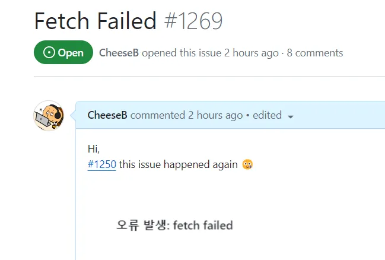

다행히 그냥 이전의 이슈를 멘션하고 'happened again' 이라고만 해도 돼서 나의 보잘것 없는 영어실력이 발목을 잡는 일은 없었다.

그리고 이슈를 올린지 5분도 채 지나지 않아, 동일한 문제를 겪고 있는 분들이 댓글을 달아주었다.

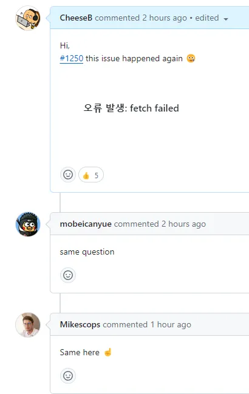

이분들도 얼마나 답답했을까ㅋㅋ..

## 개발자의 답변

얼마 지나지 않아, 개발자 님에게서 답변이 달렸다.   
이렇게 답변이 빨리 달릴 거라곤 생각지 못했는데, 답변 내용은 더 생각지 못한 것이었다.

> _이 문제에 대해 인지하고 있지만, 지금 휴가 중이고 노트북이 없기 때문에 1월 2일까지는 문제를 해결하지 못할 것 같습니다.   - laymonage_

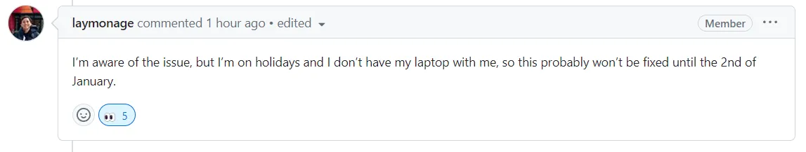

뜬금없이 giscus 개발자의 휴가 소식을 알게 되었다.
<small>~~노트북 없는 연말 휴가 개부럽네~~</small>

아무튼 짧은 감사 인사를 남기고, 이후에 이어진 다른 개발자의 문의사항에 파파고의 힘을 빌려 답변을 남겨주고 마무리 했다.

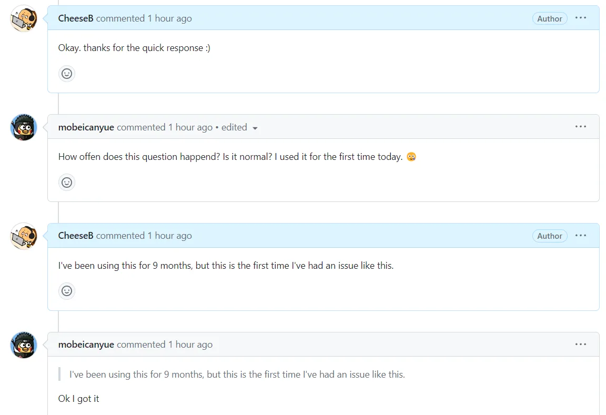

오늘 처음 라이브러리를 사용했는데 이 에러가 떴다 하심ㅋㅋㅋ..

## 깨달은 점

### 1. 발생했던 이슈와 해결법은 잘 기록해놓자

만약 내가 오류 발견 후에 github issue 를 확인하지 않았더라면, 대체 무엇이 문제인가 하고 한참을 붙잡고 있었을 것이다. **누군가가 이전에 겪었던 이슈사항이 잘 기록되어 있었기에 동일한 이슈가 발생했을 때 빠르게 해결할 수 있었던 것이다.**

꼭 깃허브 issue 를 활용하지 않더라도, 협업을 할 때든 혼자서 개발할 때든 이슈 기록은 잘 해두는게 좋다는 것을 깨달았다. 특히 협업을 할 땐 나의 기록으로 누군가의 삽질을 예방해줄 수 있다는 큰 효과가 있기에 더욱 기록을 잘 남겨둬야 한다. <small>(그 누군가가 또다시 내가 될 수 있기도 함)</small>

### 2. 에러를 띄울 땐 어느 정도의 성의는 보이자

솔직히 개발자님에게 좀 아쉬웠던게, 라이브러리 자체 에러가 발생했을 때 그걸 좀 더 명확하게 표시해 주셨으면 했던 점이다. 초반에 보여준 것처럼, 그저 '오류발생: fetch failed' 라는 텍스트만 보이니까 블로그 개발자 입장에서도 이게 난데없이 어디서 나온 에러인지 한눈에 파악하기도 어렵고, 블로그를 읽는 사람들도 이게 뭐지 싶었을 것이다.

#### 라이브러리 오류의 또다른 피해자들..

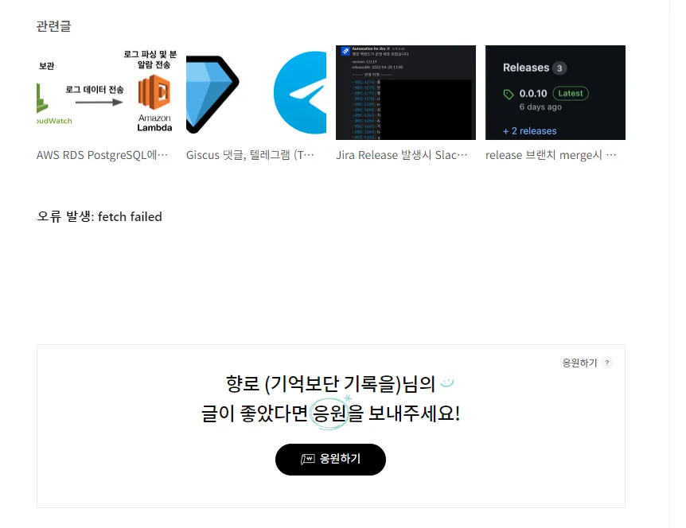

향로님도 당해버리심.. (출처: https://jojoldu.tistory.com/704)

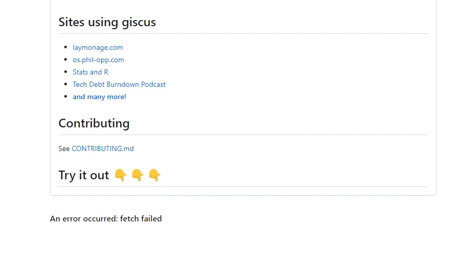

giscus 공식 페이지도 똑같음ㅋㅋ (출처: https://giscus.app)

#### 내가 만들어본 giscuss 에러창

아쉬운 마음에 피그마로 대강 giscuss 에러창을 만들어봤다.   
내가 UI/UX에 대해 잘 알지는 못하지만, 적어도 에러 영역을 눈에 띄게 잡아주고 giscus 로고라도 띄워 주었으면 좀 낫지 않았을까 하는 개인적인 의견을 반영했다.

- 버전 1

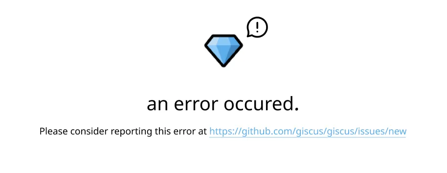

뭔가 너무 404 에러페이지같아서 패스

- 버전 2

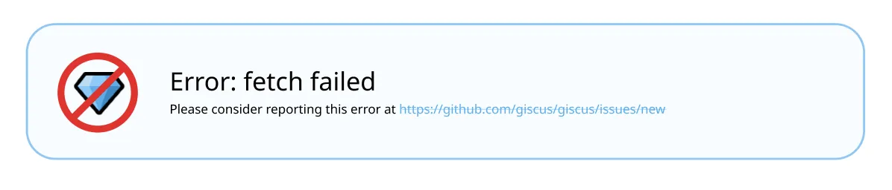

이것도 뭔가 이상함

> 그냥 개발이나 열심히 하자..

## 마치며

사실 개발자가 오픈소스에 issue를 남겼다는 게 이렇게 하나하나 적어둘 정도로 대단한 일도 아니고 어느정도 개발 좀 해본 사람이라면 매우 흔한 일이겠지만, 나에겐 이번이 처음이었고 생각보다 정말 신기하고 새로운 경험이어서 이렇게 블로그에 바로 글을 썼다.

비록 내가 영문으로 잘 정리된 이슈를 올린 것도 아니고, 딱히 그렇게 의미있는 대화를 나눈 것 같지도 않지만 이렇게 공개된 레포지토리에 이슈를 올리고 댓글로 전 세계의 개발자들과 소통을 해봤다는 것 자체로도 나에겐 너무 뜻깊은 경험이었다.

지금도 [해당 이슈](https://github.com/giscus/giscus/issues/1269)에는 새로운 댓글이 간혹 달리고 있다.   
이들이 어떤 대화를 나누는지 한번씩 보는 것도 하나의 소소한 재미가 되었으며, 다시 한번 새삼스레 '소통'의 재미를 알게 되었다. <small>(영어공부는 덤)</small>

그럼 giscus 개발자님께서 무사히 휴가를 잘 보내고 오시길, 그리고 조속히 에러를 해결해 주시길 바라며 이만 마치도록 하겠다.

---

<small>부디 이 글을 읽는 사람이 있을 즈음엔 이 밑에 '오류발생: fetch failed' 가 아닌 정상적인 댓글창이 있기를😅</small>