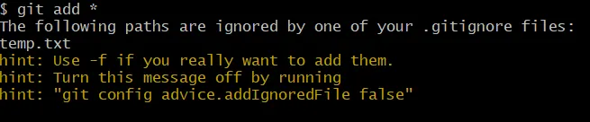

## git add . 과 git add * 명령어의 차이

두 명령어 모두 **현재 디렉토리 안의 모든 파일을 add** 시키지만,   
.gitignore 를 반영하느냐 안하느냐의 차이가 있다.

- `git add *` : gitignore에 명시된 파일까지 전부 add시킴
- `git add .` : gitignore에 명시된 파일은 **제외하고** add시킴

> 결론: git add . 을 쓰자

난 지금껏 github desktop을 주로 사용했고, 명령어를 쓰더라도 alias로만 계속 써왔어서 두개의 차이를 모르고있었다.. <small>(이제보니 git add . 명령어를 alias로 등록해놨어서 지금까지 문제가 없었던 것 같다)</small>   
가끔 명령어를 입력할 땐 아무 생각없이 git add * 을 사용했었는데, 웬만해선 git add . 으로 사용하는 것이 좋을것 같다.

---

\+ 추가

사실 git add * 을 쓴다고 해서 깃이 무지성으로 다 add시키지는 않고, 정말 ignore된 파일까지 다 넣을거면 -f 옵션을 사용하라고 안내해 준다.

어쩐지 이 글을 쓰면서도 '여태 git add * 을 써도 ignore된 파일이 올라간적은 없었는데..?' 라는 생각이 들었는데, 똑똑한 깃이 지금껏 실수를 방지해주고 있었던 것이다. <small>매번 add 할때마다 노란색으로 뭐라고 하던걸 그냥 지나치지 말았어야했다..</small>