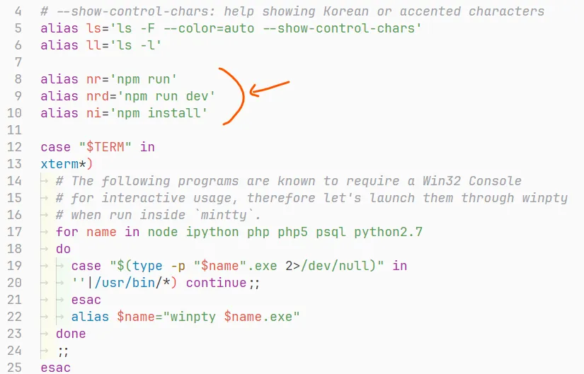

## 폴더명, 파일명 대소문자 구분하기

**깃은 기본적으로 폴더/파일명의 대소문자를 구분하지 않는다.**   
이로 인해 한번 저장소에 올렸던 폴더/파일명의 대소문자만 바꾸었을 때, 제대로 반영되지 않아 애를 먹은 적이 많을 것이다.   
그러므로 처음부터 global config에 아래처럼 세팅을 해두자.

```bash
git config --global core.ignorecase false
```

말 그대로 대소문자를 무시하는 옵션을 끄는 것이다.

## 윈도우에서 CRLF를 LF로 변경하기

윈도우는 CRLF, 맥은 LF로 개행 방식에 차이가 있다. 이것 때문에 윈도우와 맥 유저가 서로 협업을 하게 된다면 상당히 불편한 상황이 많이 생긴다. 예를 들어 코드를 수정하지 않았는데 개행문자 때문에 깃에서 변경사항이 있다고 판단하기도 하고, 린트에서 LF를 강제한다면 모든 코드에 빨간줄이 뜨는 상황을 종종 볼수 있다. 이런 이유로 개행 방식을 통일~~하거나 맥북을 구입~~해야 하는데, 보통은 LF로 통일하는 편이므로 애초에 Git global로 설정해두면 이후에는 편하게 작업할 수 있다.

### 설정 방법

아래 두 명령어를 입력하면 된다.

```bash
git config --global core.eol lf
git config --global core.autocrlf input
```

#### core.eol
> 깃에서 줄바꿈을 처리하는 방식을 결정
- **native (default):** 시스템 설정에 따름
- **crlf:** CRLF를 개행문자로 사용
- **lf:** LF를 개행문자로 사용

#### core.autocrlf
> 깃 이력 데이터를 관리하는 DB에서 줄바꿈을 어떻게 처리할지 결정
깃의 모든 이력 데이터는 .git 폴더에 있으며, 텍스트 파일을 이 이력 데이터 저장소에 주고받으면서 변경사항을 확인한다.
- **false (default):** 파일에 CRLF를 사용했든 LF를 사용했든 파일을 건드리지 않고 그대로 저장소로 주고받음
  - 개행 방식이 다르면 깃에서 파일이 변경되었다고 판단함
- **true:** 깃 이력 저장소에서 파일을 가져올 때 LF를 CRLF로 변경하고, 저장소로 보낼 때 CRLF를 LF로 변경함
- **input:** LF를 개행문자로 사용

인터넷을 찾아보면 윈도우는 기본적으로 CRLF를 사용하기 때문에 보통 autocrlf를 true로 설정하라고 하지만, 굳이 파일을 가져올 때 LF를 CRLF로 바꿀 필요가 없을것 같아서 나는 input으로 설정해 두었다.   
input으로 설정해도 윈도우에서 작업하기 어려움이 있었다거나 협업 시 문제가 생기지는 않았다.

## Git Alias 설정

커밋 단위를 작게 하는것이 좋다는 것은 개발자라면 익히 알고 있는 사실이다. 그렇기에 우리는 개발 도중 수많은 `git add` 와 `git commit` 을 하게 된다. 이렇게 자주 쓰는 명령어나 혹은 너무 길어서 입력하기 귀찮은 명령어들은 별칭을 설정해두면 좋다.

```bash
git config --global alias.c commit
git config --global alias.cm 'commit -m'
```

위와 같이 단 하나의 명령어라면 `alias.[별칭] [원래 명령어]` 와 같이 작성하고, 공백으로 이어져 있는 명령어라면 원래 명령어를 따옴표로 감싸야 한다.

또한, 이미 설정해둔 별칭을 해제하고 싶다면 아래와 같이 unset 옵션을 사용하면 된다.

```bash
git config --global --unset alias.cm
```

## Git Bash Alias 설정

위에서 소개한 것은 git 명령어에만 국한된 별칭이지만, git 명령어 뿐 아니라 모든 명령어에 별칭을 사용하는 방법도 있다. 바로 Git Bash 세팅 파일에 alias를 추가하는 것이다.

나는 윈도우에서도 리눅스 명령어를 사용하기 위해 VScode의 기본 터미널을 Git Bash로 설정해놓고 사용중인데, 나처럼 Git Bash를 윈도우의 기본 터미널이나 파워쉘 대신 사용하는 분들이 많을 것 같아서, Git에 관련된 세팅은 아니지만 Git Bash로 단축 명령어 등록하는 법도 함께 소개하려 한다.


<div class="source">VScode 터미널에 Git Bash를 띄운 모습</div>

### 설정 방법

1. `C:\Program Files\Git\etc\profile.d\aliases.sh` 파일을 찾아서 연다
2. 다음과 같이 alias를 추가한다   
   
3. `C:\Program Files\Git\etc\bash.bashrc` 파일을 찾아서 연다
4. 맨 마지막 줄에 `. /etc/profile.d/aliases.sh` 이 한줄을 추가한다   
   
5. 터미널에서 `/etc` 로 이동한다
6. `source bash.bashrc` 명령어를 입력한다

나는 이렇게 세팅을 한 후 `npm run dev` 를 `nrd` 라고만 쓰는 등 명령어를 입력하는 시간이 눈에 띄게 줄어들어서 개인적으로 매우 추천하는 세팅이다. 다만 아직 Git 명령어가 손에 익을만큼 익숙해지지 않은 개발자라면, 먼저 명령어에 익숙해진 뒤 설정할 것을 추천한다.

## 참고 사이트

- [lesstif.com - git 에서 CRLF 개행 문자 차이로 인한 문제 해결하기](https://www.lesstif.com/gitbook/git-crlf-20776404.html)
- [korjsh.log - [unix] 윈도우 gitbash에서 alias 설정하기](https://velog.io/@korjsh/unix-%EC%9C%88%EB%8F%84%EC%9A%B0-gitbash%EC%97%90%EC%84%9C-alias-%EC%84%A4%EC%A0%95%ED%95%98%EA%B8%B0)
- [딸바보아재 개발기 - git 은 폴더/파일명의 대소문자를 개무시한다. 그럼 우째?](https://papababo.tistory.com/entry/git-%EC%9D%80-%ED%8F%B4%EB%8D%94%ED%8C%8C%EC%9D%BC%EB%AA%85%EC%9D%98-%EB%8C%80%EC%86%8C%EB%AC%B8%EC%9E%90%EB%A5%BC-%EA%B0%9C%EB%AC%B4%EC%8B%9C%ED%95%9C%EB%8B%A4-%EA%B7%B8%EB%9F%BC-%EC%9A%B0%EC%A7%B8)
- [갓대희의 작은공간 - [Git (8)] Git Alias - 단축키 설정 및 사용하기](https://goddaehee.tistory.com/273)