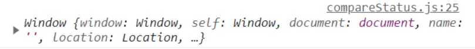
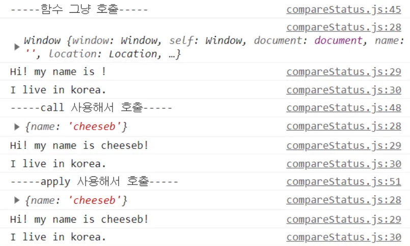
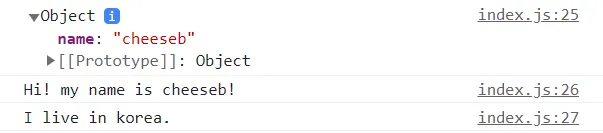

## 함수의 This

자바스크립트에서 함수 내부의 this 값은 함수를 호출한 방법에 의해 좌우된다.

객체 내부, 메서드 호출, 생성자 new 호출, 명시적 bind 등등 여러 상황이 있지만   
이런 상황이 아닐 때 기본적으로 this 는 브라우저에선 window 객체를, 노드에서는 빈 객체를 가리킨다.

```js
function showThis() {
	console.log(this);
}
```



여기서 함수가 window 가 아닌 다른 객체를 this로 참조하도록 하고 싶을 때, bind/call/apply 함수를 사용할 수 있다.

## call / apply

> 함수의 this를 대체해서 호출하는 메서드

call과 apply 는 둘 다 함수를 호출하는 메서드이며, 첫번째 인자에 this로 세팅할 객체를 넘겨준다.

두 함수의 유일한 차이점은 함수의 매개변수를 전달하는 방식이다.

- **call**: 매개변수를 단일 인자로 넘겨줌
- **apply**: 매개변수 개수에 상관 없이 모두 배열에 넣어줘야 함

<div class="code-header">
	<span class="red btn"></span>
	<span class="yellow btn"></span>
	<span class="green btn"></span>
</div>

```js
function say(country) {
  console.log(this);
  console.log(`Hi! my name is ${this?.name}!`);
  console.log(`I live in ${country}.`);
}

const obj = { name: 'cheeseb' };

say('korea');
say.call(obj, 'korea');
say.apply(obj, ['korea']);
```



## bind

> 함수의 this를 대체한 복제 함수를 리턴하는 메서드

bind 는 함수를 실행하는 메서드가 아닌, 원본 함수의 this만 대체한 복사본을 새로 리턴하는 메서드이다.

<div class="code-header">
	<span class="red btn"></span>
	<span class="yellow btn"></span>
	<span class="green btn"></span>
</div>

```js
function say(country) {
  console.log(this);
  console.log(`Hi! my name is ${this?.name}!`);
  console.log(`I live in ${country}.`);
}

const obj = { name: 'cheeseb' };

const boundSay = say.bind(obj);
boundSay('korea');
```



## 화살표 함수의 this

함수 호출 시 this에 바인딩 될 객체가 동적으로 결정되는 일반 함수와 다르게,   
화살표 함수는 this에 바인딩될 객체가 정적으로 결정된다.

> 화살표 함수의 this는 항상 상위 스코프의 this를 가리킨다.

<div class="code-header">
	<span class="red btn"></span>
	<span class="yellow btn"></span>
	<span class="green btn"></span>
</div>

```js
const temp = { 
    age: 10, 
    tempFunc() { 
    	console.log(this.age); // 10
    } 
} 

const temp1 = { 
    age: 10, 
    tempFunc: () => { 
    	console.log(this.age); // undefined 
    } 
} 

temp.tempFunc();
temp1.tempFunc();
```

> 또한, 화살표 함수는 call/apply/bind 메서드로 this를 변경하는 것도 불가능하다.

<div class="code-header">
	<span class="red btn"></span>
	<span class="yellow btn"></span>
	<span class="green btn"></span>
</div>

```js
window.x = 1;
const normal = function () { return this.x; };
const arrow = () => this.x;

console.log(normal.call({ x: 10 })); // 10
console.log(arrow.call({ x: 10 }));  // 1
```

이러한 이유 때문에 다음과 같은 경우에는 화살표 함수를 사용해선 안된다.

### 화살표 함수를 사용하면 안되는 경우

####  메소드 정의

this가 메소드를 호출한 객체를 가리키지 않고, 상위 컨텍스트인 전역 객체를 가리키게 된다.

#### addEventListener의 콜백 함수

메소드 정의와 같은 이유로, 콜백 함수 내에서 this를 사용하는 경우 이벤트리스너에 바인딩된 요소를 가리키는 것이 아닌, 전역 객체(window) 를 가리키게 된다.

this를 사용하지 않고 e.target 을 사용한다면 상관 없을 듯 하다.

#### 생성자 함수

생성자 함수는 prototype 프로퍼티를 가지며, 프로토타입 객체의 constructor를 사용하지만 화살표 함수는 prototype 프로퍼티를 갖고있지 않으므로 생성자 함수로 사용할 수 없다.

---

## 참고 사이트

- [쾌락코딩 - binding의 개념과 call, apply, bind의 차이점](https://wooooooak.github.io/javascript/2018/12/08/call,apply,bind/)
- [Devrookie - [NodeJS] Node 의 this 란? (+ 화살표 함수의 this)](https://haeunyah.tistory.com/86)
- [PoiemaWeb - 화살표 함수](https://poiemaweb.com/es6-arrow-function)