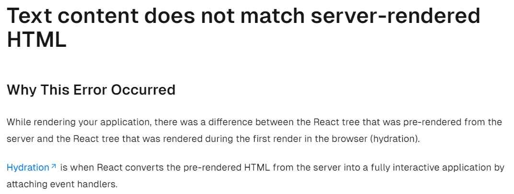

## 에러 상황

Next.js 프로젝트에서 테이블 컴포넌트를 만들던 중, 별 작업을 하지도 않았는데 아래와 같이 에러가 발생했다.

**Error**: Hydration failed because the initial UI does not match what was rendered on the server.
**Warning**: Expected server HTML to contain a matching `<tr>` in `<table>`.

테이블 컴포넌트 코드는 다음과 같다.

<div class="code-header">
	<span class="red btn"></span>
	<span class="yellow btn"></span>
	<span class="green btn"></span>
</div>

```tsx
<table className={styles.table}>
  <tr>
    <th>이름</th>
    <th>초대자</th>
    <th>수락 여부</th>
  </tr>
  {invitations.map(invitation => (
    <tr>
      <td>{invitation.dashboard}</td>
      <td>{invitation.inviter}</td>
      <td>{invitation.inviteAccepted ? "수락" : "거절"}</td>
    </tr>
  ))}
</table>
```

## 해결 방법

#### thead, tbody 를 추가해 주면 된다

<div class="code-header">
	<span class="red btn"></span>
	<span class="yellow btn"></span>
	<span class="green btn"></span>
</div>

```tsx
<table className={styles.table}>
  <thead>
    <tr>
      <th>이름</th>
      <th>초대자</th>
      <th>수락 여부</th>
    </tr>
  </thead>
  <tbody>
    {invitations.map(invitation => (
      <tr>
        <td>{invitation.dashboard}</td>
        <td>{invitation.inviter}</td>
        <td>{invitation.inviteAccepted ? "수락" : "거절"}</td>
      </tr>
    ))}
  </tbody>
</table>
```

## 해결 과정과 에러 발생 이유

처음엔 에러 메세지를 대충 보고 table 태그를 잘못 썼나 했는데, 진짜로 잘못 썼었다. <small>(테이블 헤더 태그가 tr + th 인지, th + td 인지 나만 항상 헷갈리는건가..?)</small> 하지만 제대로 고쳤는데도 에러가 해결되지 않았다.   
invitations 배열을 매핑하는 부분의 잘못인지, 아니면 테이블 자체의 문제인지 확인하기 위해 invitations 매핑하는 부분을 지우고 헤더 부분만 남겨놨는데도 똑같은 에러가 발생해서, 테이블 태그 자체의 문제임을 알아냈다.

그리고 나서 에러를 해결한 건 사실 우연이었다. 테이블 태그를 잘못 쓴게 아닐까 했을때, 무엇이 제대로된 코드인지 찾아보는 과정에서 thead와 tbody를 넣은 코드를 보았고, thead와 tbody태그를 사용하는게 의미론적으로도, 접근성 측면에서도 좋다는 것이 기억나서 코드에 추가했더니 갑자기 에러가 해결됐다.

그 후에 공식 문서를 통해 에러가 발생한 원인을 찾아보았는데, **서버에서 pre-render된 리액트 트리와 브라우저에서 처음 렌더링된 리액트 트리 간에 차이가 있어서 hydration에 실패**한 것이었다.   




### hydration 이란?

> 서버에서 보내준 HTML 코드에 JS 코드가 매칭되는 과정

Next.js는 서버에서 pre-rendering 된 정적인 HTML 페이지를 클라이언트에 먼저 보내주고 나서, 번들링된 JS 코드(React 코드였던 것)를 전송한다.   
여기서 **JS 코드가 각각 알맞은 HTML 태그에 매칭**되면서 비로소 상호작용이 가능한 웹페이지가 되는데, 이 과정이 마치 메마른 HTML 땅에 JS 물을 뿌려서 수분을 주는 듯 하여 Hydration 이라 부른다. 위에서 설명한 에러로 미루어 보았을 때, hydration은 프리렌더링된 HTML의 DOM 트리와 브라우저에서 JS로 처음 렌더링된 React 트리 간에 동기화가 이뤄지는 과정이라고도 할 수 있으며, 이것이 실패했을 때 hydration 에러가 발생한다고 볼 수 있다.

### thead, tbody를 추가했을때 해결되는 이유

사실 **브라우저는 코드에 작성하지 않았어도 thead, tbody를 자동으로 테이블에 추가해준다.** 그렇기 때문에 브라우저의 첫 렌더링때는 thead, tbody가 존재하지만 기존에 받았던 HTML DOM에는 없어서 위와 같은 에러가 발생했던 것이다. 이는 Next.js 를 사용하지 않고 그냥 React로 테이블을 만들 때에도 문제가 된다. 리액트가 리렌더링을 진행할 때 브라우저가 자동으로 만든 태그와 리액트의 태그가 달라서 의도치 못한 동작을 할 수 있기 때문이다.


## 결론

#### table을 만들 땐 thead, tbody를 꼭 써주는 습관을 가지자!

앞서 말했듯, **실제 코드와 브라우저가 처리한 코드가 일관**되지 않다는 문제가 있을 뿐 아니라, 다음과 같은 이유로도 웬만해선 써주는 것이 좋다.

- 개발자가 코드를 읽을때 명확히 구분됨 - 의미론적으로(semantic) 좋음
- 테이블의 각 구조에 다른 스타일을 적용하고자 할 때 개별 행, 열마다 속성을 부여하지 않아도 됨
- 접근성이 좋아짐 (시각장애인이 화면 낭독기로 표를 들을 때 쉽게 이해 가능)

> 아니 어차피 브라우저가 알아서 넣어주는데 그냥 HTML만 쓸때는 생략해도 되는거 아닌가?

아니다. 브라우저가 알아서 넣어주긴 하는데, 제대로 넣어주지는 않기 때문이다.

<div class="code-header">
	<span class="red btn"></span>
	<span class="yellow btn"></span>
	<span class="green btn"></span>
</div>

```html
<!-- 실제 코드 -->
<table>
  <tr>
    <th>a</th>
    <th>b</th>
  </tr>
  <tr>
    <td>c</td>
    <td>d</td>
  </tr>
</table>
```


<div class="source"> 브라우저에 렌더링된 결과물 </div>

위 예시를 보면 th요소는 thead안에 들어있어야 하는게 맞지만, 실제 결과에선 전부 tbody안에 들어가있다.
이와 같이 브라우저가 제목과 데이터를 잘 구분하지 못하기 때문에 명확히 코드에 적어주는게 좋다.

<div class="code-header">
	<span class="red btn"></span>
	<span class="yellow btn"></span>
	<span class="green btn"></span>
</div>

```html
<!-- 실제 코드 -->
 <table>
  <thead>
    <tr>
      <th>a</th>
      <th>b</th>
    </tr>
  </thead>
  <tbody>
    <tr>
      <td>c</td>
      <td>d</td>
    </tr>
  </tbody>
</table>
```


<div class="source"> 편-안 </div>