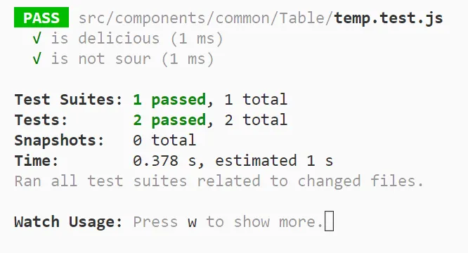
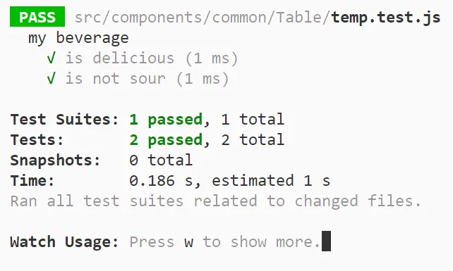

## test / it

> 테스트 케이스를 정의하는 함수

각 테스트 코드를 안에 작성하고, 테스트를 할 수 있도록 하는 함수이다.
두 키워드는 완전히 동일한 역할을 하므로 (it키워드가 test키워드의 별칭), 취향에 따라 선택하면 된다.

<div class="code-header">
	<span class="red btn"></span>
	<span class="yellow btn"></span>
	<span class="green btn"></span>
</div>

```js
test('did not rain', () => {
  expect(inchesOfRain()).toBe(0);
});

it('did not rain', () => {
  expect(inchesOfRain()).toBe(0);
});
```

만약 테스트에서 promise 를 리턴하도록 한다면, Jest는 promise가 resolve되기 전까진 테스트를 완료시키지 않는다.

<div class="code-header">
	<span class="red btn"></span>
	<span class="yellow btn"></span>
	<span class="green btn"></span>
</div>

```js
it('has lemon in it', () => {
  return fetchBeverageList().then(list => {
    expect(list).toContain('lemon');
  });
});
```

## describe

> 작은 단위의 여러 테스트 케이스(test, it)를 그룹화함

특정 컴포넌트에 속하는 테스트 코드가 여러개일 때, describe를 사용해서 그룹화할 수 있다.   
describe를 사용하는 것이 필수는 아니지만, 테스트를 작성할 때와 테스트 결과를 확인할 때 가독성이 더 좋으지므로 사용을 권장한다.

<div class="code-header">
	<span class="red btn"></span>
	<span class="yellow btn"></span>
	<span class="green btn"></span>
</div>

```js
const myBeverage = {
  delicious: true,
  sour: false,
};

describe('my beverage', () => {
  it('is delicious', () => {
    expect(myBeverage.delicious).toBeTruthy();
  });

  it('is not sour', () => {
    expect(myBeverage.sour).toBeFalsy();
  });
});
```


<div class="source">describe 사용 전</div>


<div class="source">describe 사용 후</div>


## 참고 자료

- [Jest 공식 API 문서](https://jestjs.io/docs/api)