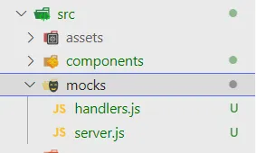
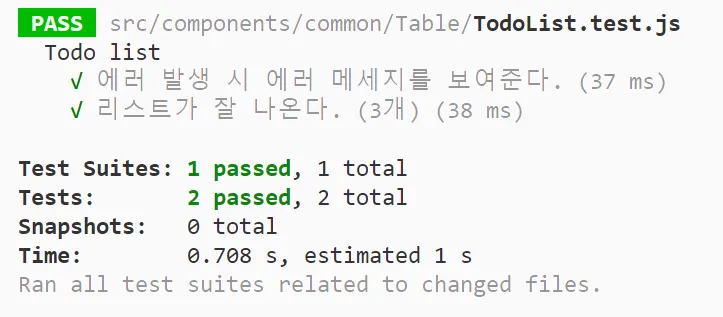

## 모킹(Mocking) 이란?

> 단위 테스트를 작성할 때, 해당 코드가 의존하는 부분을 가짜(mock)로 대체하는 기법

특정 컴포넌트를 테스트할 때, 테스팅 범위가 아니지만 의존성이 있는 다른 모듈이 있을 수 있다.   
이를 실제 모듈로 불러와서 테스트 한다면 다음과 같은 문제가 생길 수 있다.

- 아직 개발되지 않은 모듈에 의존한다면 테스팅/개발이 어려움
- 다른 모듈에 의해 테스트 결과가 바뀔 수 있어, 해당 컴포넌트에 대해서만 독립적인 테스트를 할 수 없음
	- 특정 기능만 분리해서 테스트한다는 '단위' 테스트의 의미에 적합하지 않음
- 테스트 실행 속도가 떨어지고, 이는 프로젝트 규모가 커져서 한번에 실행할 테스트 케이스가 많아지면 더 큰 이슈가 될 수 있음
	- CI/CD 파이프라인의 일부로 테스트가 자동화되어 자주 실행되어야 한다면 더 큰 문제가 됨

이런 상황에서 실제 모듈을 모방한 가짜 모듈을 생성하는것이 mocking 이다.


## 프론트엔드에서 백엔드 모킹이 필요한 경우

- API가 아직 구현이 되어있지 않을 때
- 원하는 형태의 데이터로 테스트하고 싶을 때<br><small>ex) 상품명이 10자 이상일 때, 판매 중단된 상품 목록만 보고싶을 때</small>
- 서버 에러가 난 상황을 테스트하고 싶을 때<br><small>ex) 500에러가 났을 때의 화면을 보고싶을때</small>

## 임의로 객체를 만들어서 테스트하기

<div class="code-header">
	<span class="red btn"></span>
	<span class="yellow btn"></span>
	<span class="green btn"></span>
</div>

```js
jest.spyOn(window, "fetch").mockImplementation(() => {
	return Promise.resolve({
			json: () => Promise.resolve([
					{ id: 1, title: "Blog 1", author: "Author 1" },
					{ id: 2, title: "Blog 2", author: "Author 2" },
					{ id: 3, title: "Blog 3", author: "Author 3" },
			])
	})
});
```

이는 fetch 를 모킹한 예제로, fetch를 호출하고 json 메서드를 호출하면 실제 서버가 아닌 위에 명시한 객체 리스트를 응답하도록 변경한 것이다.

이렇게 직접 데이터를 만들어서 넣는 것도 mocking의 방법이지만, 이렇게 하면 나중에 호출 방식이 바뀌었을 때 테스트 또한 하나하나 바꿔줘야 한다는 큰 문제가 생긴다. 그러므로 MSW와 같은 mock 서버를 이용해 테스트를 하는 것이 좋다.

## MSW(Mock Service Worker) 란?

> 네트워크 레벨에서 요청을 가로채서 모의 응답을 보내주는 API 모킹 라이브러리

- [공식 사이트](https://mswjs.io/)

이 라이브러리의 장점은 모든 종류의 네트워크 라이브러리<small>(ex. axios, react-query 등)</small> 와, fetch 메스드에서 함께 사용 가능하다는 것인데, 이는 어플리케이션 레벨이 아닌 네트워크 레벨에서 요청을 가로채 응답을 보내기 때문이다.

MSW에 대한 더 자세한 설명은 [이 블로그](https://velog.io/@khy226/msw%EB%A1%9C-%EB%AA%A8%EC%9D%98-%EC%84%9C%EB%B2%84-%EB%A7%8C%EB%93%A4%EA%B8%B0)에 잘 정리되어 있으므로 궁금하신 분들은 방문해 보셔도 좋을 것 같다.

## MSW 로 Rest API Mock 만들기

### 설치하고 세팅하기

- 여기선 Rest API를 모킹하는 방법만 다룰 것이므로, GraphQL API를 모킹하는 방법은 [공식 문서](https://mswjs.io/docs/getting-started/mocks/graphql-api) 를 확인하면 좋을 것 같다.

아래 명령어를 사용해서 MSW를 프로젝트에 설치한다.

```shell
# npm
npm install msw --save-dev

# yarn
yarn add msw --dev
```

src 안에 mocks 폴더를 만들고, 그 안에 `server.js` 파일과 `handlers.js` 파일을 만든다.



#### CRA 환경에서 MSW 사용하기

CRA 로 프로젝트를 만들면 src 내에 `setupTest.js` 파일이 있을 것이다. 이는 테스트 환경을 세팅하기 위한 파일로, 초기에는 jset-dom 라이브러리를 임포트하는 구문 밖에 없다.   
CRA 환경에서 MSW를 사용하기 위해선 이 파일 안에 다음과 같이 작성해야 한다.

<div class="code-header">
	<span class="red btn"></span>
	<span class="yellow btn"></span>
	<span class="green btn"></span>
</div>

```js
import '@testing-library/jest-dom';
import { server } from './mocks/server.js'; // (1)

beforeAll(() => server.listen()); // (2)
afterEach(() => server.resetHandlers()); // (3)
afterAll(() => server.close()); // (4)
```

1. 미리 server.js에 설정해둔 모킹 서버를 불러옴
2. 테스트를 시작하기 전에 모킹 서버를 연결함
3. 각 테스트가 끝나면 핸들러를 초기화해서, 다른 테스트에 영향을 주지 않도록 함
4. 모든 테스트가 끝난 후, 모킹 서버를 닫아줌

여기서 beforeAll, afterEach, afterAll 은 Jest에서 제공하는 테스트 전후처리 함수이다.

- **beforeEach / afterEach:** 각각의 테스트 함수가 실행되기 전 / 실행된 후에 매번 실행할 코드
- **beforeAll / afterAll:** 테스트를 시작하기 전 / 다 끝난 후에 딱 한번만 실행할 코드

더 자세한 내용은 [공식문서](https://jestjs.io/docs/api) 를 참고하면 좋을 것 같다.

### 모킹 서버 설정, 핸들러 작성법

servers.js 는 모킹 서버를 설정하는 역할을 한다.

<div class="code-header">
	<span class="red btn"></span>
	<span class="yellow btn"></span>
	<span class="green btn"></span>
</div>

```js
// src/mocks/server.js
import { setupServer } from 'msw/node';
import { handlers } from './handlers';

// 불러온 handler들을 통해 모킹 서버를 설정
export const server = setupServer(...handlers);
```

필요한 REST API 요청들은 handlers.js 안에 명시해 두면 된다.

<div class="code-header">
	<span class="red btn"></span>
	<span class="yellow btn"></span>
	<span class="green btn"></span>
</div>

```js
// src/mocks/handlers.js
import { rest } from 'msw';

export const handlers = [];
```

여기서 handlers 배열 안에 원하는 요청 경로와 메서드, 응답값을 다 작성할 수 있다.

<div class="code-header">
	<span class="red btn"></span>
	<span class="yellow btn"></span>
	<span class="green btn"></span>
</div>

```js
import { rest } from 'msw';

export const handlers = [
	rest.get('실제 API 요청 주소', (req, res, ctx) => { // 요청 경로, 메서드
		return res(); // 응답값
	})
]
```

먼저, 모킹 서버가 가로챌 실제 요청 API를 알려준다.   
rest.get / rest.post 등 요청을 보낼 HTTP 메서드를 명시하고 첫번째 인자로는 실제 API 주소를, 두번째 인자로는 mock 데이터를 리턴할 콜백함수를 정의한다.

여기서 함수는 다음 세가지 인자를 받는다.

- **req (request):** 매칭되는 요청에 대한 정보
- **res (response):** 모의 응답을 만들 수 있는 유틸리티
- **ctx (context):** 모의 응답의 HTTP 상태 코드, 헤더, 바디 등을 만들 수 있는 함수들

<div class="code-header">
	<span class="red btn"></span>
	<span class="yellow btn"></span>
	<span class="green btn"></span>
</div>

```js
import { rest } from 'msw';

export const handlers = [
	  rest.get('실제 API 요청 주소', (req, res, ctx) => {

    return res(
      ctx.status(200), // 상태 코드
      ctx.json(...), // 응답 데이터
    );
  }),
];
```

콜백 함수의 리턴값인 res 에다 응답받고자 하는 값 (mock데이터)을 정의할 수 있다.   
첫번째 인자에는 HTTP 상태 코드를, 두번째 인자에는 결과값으로 받을 JSON 데이터를 정의한다.

이렇게 하면 특정 API에 요청을 보내는 코드를 테스트할 때, MSW가 요청을 가로채서 미리 정의된 상태 코드와 데이터로 응답을 받을 수 있다.

<div class="code-header">
	<span class="red btn"></span>
	<span class="yellow btn"></span>
	<span class="green btn"></span>
</div>

```js
import { rest } from 'msw';

export const handlers = [
	rest.get('/board', (req, res, ctx) => {
    return res(
			// 상태 코드를 명시하지 않으면, 200으로 들어옴
      ctx.json([{
				id: 1,
				title: 'test board'
			},{
				id: 2,
				title: 'test board2'
			}]),
    );
  }),

	rest.post('/board', (req, res, ctx) => {
    return res(
      ctx.status(500),
			ctx.json({
				errorMessage: 'Invalid Input',
			}),
    );
  }),

	rest.post('/comment', (req, res, ctx) => {
    return res(
      ctx.status(201), // 데이터 없이 상태값만 받는것도 가능
    );
  }),
];
```

위와 같이 handlers 안에 모킹할 API 요청들을 여러개 정의해 놓을 수 있다.

모킹을 작성할 때 주의할 점은, 반드시 로직을 통한 응답이 아닌 **정해진 데이터로 응답**해야 한다는 것이다.   
로직을 사용한다면 Mock의 응답을 장담을 수 없고, 테스트가 실패할 경우 Mock의 문제인지 컴포넌트의 문제인 지 알 수가 없기 때문이다.

## MSW를 사용한 모킹 예시

테스트할 컴포넌트는 아래와 같다.

<div class="code-header">
	<span class="red btn"></span>
	<span class="yellow btn"></span>
	<span class="green btn"></span>
</div>

```jsx
import React, { useEffect, useState } from 'react';

export default function TodoList() {
  const [todoList, setTodoList] = useState([]);
  const [errorMsg, setErrorMsg] = useState('');

  useEffect(() => {
    fetch('https://jsonplaceholder.typicode.com/todos')
      .then((res) => res.json())
      .then((json) => setTodoList(json))
      .catch(() => setErrorMsg('에러 발생'));
  }, []);

  return (
    <>
      <h1>Todo</h1>
      {errorMsg ? (
        <p>{errorMsg}</p>
      ) : (
        <ul>
          {todoList.map((todo) => (
            <li
              key={todo.id}
              style={{ textDecoration: todo.completed ? 'line-through' : undefined }}
            >
              {todo.title}
            </li>
          ))}
        </ul>
      )}
    </>
  );
}
```

fetch할 url은 무료로 todoList 객체를 제공해주는 API 이다. 이를 통해 객체 리스트를 받아오면 map을 돌면서 리스트 형태로 렌더링하고, 에러 발생 시 에러메세지만 띄워주는 코드이다.

여기서 fetch 안의 url이 실제로 데이터를 받아올 API라 가정하고, 해당 API를 모킹하는 코드를 handlers.js 안에 작성할 것이다.

<div class="code-header">
	<span class="red btn"></span>
	<span class="yellow btn"></span>
	<span class="green btn"></span>
</div>

```js
import { rest } from 'msw';

export const handlers = [
  rest.get('https://jsonplaceholder.typicode.com/todos', (req, res, ctx) => {
    return res(
      ctx.status(200),
      ctx.json([
        {
          id: 1,
          title: '청소',
          completed: true,
        },
        {
          id: 2,
          title: '설거지',
          completed: false,
        },
        {
          id: 3,
          title: '숙제',
          completed: true,
        },
      ]),
    );
  }),
];
```

그리고 테스트 코드를 다음과 같이 작성하면, mock 데이터를 응답받아 테스트에 통과하는 것을 확인할 수 있다.

<div class="code-header">
	<span class="red btn"></span>
	<span class="yellow btn"></span>
	<span class="green btn"></span>
</div>

```js
describe('Todo list', () => {
  it('리스트가 잘 나온다. (3개)', async () => {
    render(<TodoList />);
    const list = await screen.findAllByRole('listitem');
    expect(list).toHaveLength(3);
  });
});
```

에러를 발생시켜 보고 싶으면, 다음과 같이 테스트 케이스를 추가하면 된다.

<div class="code-header">
	<span class="red btn"></span>
	<span class="yellow btn"></span>
	<span class="green btn"></span>
</div>

```js
describe('Todo list', () => {
  test('리스트가 잘 나온다. (3개)', async () => {
    render(<TodoList />);
    const list = await screen.findAllByRole('listitem');
    expect(list).toHaveLength(3);
  });

  test('에러 발생 시 에러 메세지를 보여준다.', async () => {
    server.use(
      rest.get('https://jsonplaceholder.typicode.com/todos', (req, res, ctx) => {
        return res(ctx.status(200));
      }),
    );
    render(<TodoList />);
    const error = await screen.findByText('에러 발생');
    expect(error).toBeInTheDocument();
  });
});
```

위와 같이 테스트케이스 내부에 server.use 를 통해서 mock api를 수정하면 해당 테스트에만 핸들러가 적용되고, 다른 테스트에는 영향을 주지 않는다. 이는 [setupTest.js](#cra-환경에서-msw-사용하기) 에서 `afterEach(() => server.resetHandlers())` 로 각 테스트를 실행하고 난 뒤에 매번 핸들러를 리셋해주기 때문이다.

그러므로, 다음과 같이 에러 발생 테스트를 먼저 수행해도 다음 테스트에서 모킹 api가 에러를 반환하지 않는다.

<div class="code-header">
	<span class="red btn"></span>
	<span class="yellow btn"></span>
	<span class="green btn"></span>
</div>

```js
describe('Todo list', () => {
  test('에러 발생 시 에러 메세지를 보여준다.', async () => {
    server.use(
      rest.get('https://jsonplaceholder.typicode.com/todos', (req, res, ctx) => {
        return res(ctx.status(200));
      }),
    );
    render(<TodoList />);
    const error = await screen.findByText('에러 발생');
    expect(error).toBeInTheDocument();
  });

	test('리스트가 잘 나온다. (3개)', async () => {
    render(<TodoList />);
    const list = await screen.findAllByRole('listitem');
    expect(list).toHaveLength(3);
  });
});
```



## MSW의 다양한 사용법

### Cookie

fetch 에서는 보안상의 이유로 쿠키 세팅을 할 수 없으나, MSW는 클라이언트 측에서 실행되므로 보안 위반 없이 응답으로 mock 쿠키를 수신할 있다.

<div class="code-header">
	<span class="red btn"></span>
	<span class="yellow btn"></span>
	<span class="green btn"></span>
</div>

```js
import { rest } from 'msw';

export const handlers = [
  rest.post('/login', (req, res, ctx) => {
    return res(
      ctx.cookie('auth-token', 'abc-123'),
    )
  }),
];
```

위와 같이 `ctx.cookie('key', 'value');` 를 호출하면, document.cookie 에 직접 쿠키를 설정할 수 있다.

### Query parameters

요청 파라미터에 따라서 다른 응답을 줘야하는 경우에는, 핸들러에서 req 객체를 통해 파라미터에 접근할 수 있다.

예를 들어서, `fetch('/products?id=123')` 와 같이, 파라미터로 보내는 id에 따라서 응답값이 달라져야 하는 경우에는 다음과 같이 핸들러를 작성할 수 있다.

<div class="code-header">
	<span class="red btn"></span>
	<span class="yellow btn"></span>
	<span class="green btn"></span>
</div>

```js
import { rest } from 'msw';

export const handlers = [
  rest.get('/products', (req, res, ctx) => {
    const productId = req.url.searchParams.get('id')
    return res(
      ctx.json({
        productId,
      }),
    )
  }),
];
```

이렇게 작성했을 시, `fetch('/products?id=123')` 이렇게 요청을 보냈을 때 상태 코드로 `200 OK` 응답을 받을 수 있고,

```json
{
  "productId": "123"
}
```

위와 같은 json 데이터를 받을 수 있다.

### Response patching

모킹 서버의 응답 데이터를 실제 서버의 응답 기반으로 구성할 수 있다.

이 기법은 핸들러에서 실제 서버에 요청을 보낸 후, 받은 데이터에 필요한 정보를 임의로 덧붙이는 방식으로 작동한다.

<div class="code-header">
	<span class="red btn"></span>
	<span class="yellow btn"></span>
	<span class="green btn"></span>
</div>

```js
import { rest } from 'msw';

export const handlers = [
  rest.get('https://api.github.com/users/:username', async (req, res, ctx) => {
    const originalResponse = await ctx.fetch(req)
    const originalResponseData = await originalResponse.json()

    return res(
      ctx.json({
        location: originalResponseData.location,
        firstName: 'Not the real first name',
      }),
    )
  }),
];
```

위와 같이 작성하면, 다음과 같은 응답 데이터를 받을 수 있다.

```json
{
  "location": "San Francisco",
  "firstName": "Not the real first name"
}
```

## 참고 자료

- [Jest 공식문서](https://jestjs.io/docs/api)
- [MSW 공식문서](https://mswjs.io/docs/getting-started/mocks)
- [코딩앙마 유튜브 - React Testing Library #6 MSW 를 활용한 mock API 테스트](https://www.youtube.com/watch?v=iQGRPXs_1Qc)
- [couchcoding.log - 프론트엔드 테스트 해야할까? (2) React-Testing-Library 사용해보기](https://velog.io/@couchcoding/%ED%94%84%EB%A1%A0%ED%8A%B8%EC%97%94%EB%93%9C-%ED%85%8C%EC%8A%A4%ED%8A%B8-%ED%95%B4%EC%95%BC%ED%95%A0%EA%B9%8C-2-React-Testing-Library-%EC%82%AC%EC%9A%A9%ED%95%B4%EB%B3%B4%EA%B8%B0)
- [khy__.log - MSW(Mock Service Worker)로 더욱 생산적인 FE 개발하기](https://velog.io/@khy226/msw%EB%A1%9C-%EB%AA%A8%EC%9D%98-%EC%84%9C%EB%B2%84-%EB%A7%8C%EB%93%A4%EA%B8%B0)