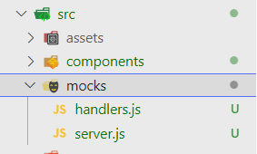

## 모킹(Mocking) 이란?

> 단위 테스트를 작성할 때, 해당 코드가 의존하는 부분을 가짜(mock)로 대체하는 기법

특정 컴포넌트를 테스트할 때, 테스팅 범위가 아니지만 의존성이 있는 다른 모듈이 있을 수 있다.   
이를 실제 모듈로 불러와서 테스트 한다면 다음과 같은 문제가 생길 수 있다.

- 아직 개발되지 않은 모듈에 의존한다면 테스팅/개발이 어려움
- 다른 모듈에 의해 테스트 결과가 바뀔 수 있어, 해당 컴포넌트에 대해서만 독립적인 테스트를 할 수 없음
	- 특정 기능만 분리해서 테스트한다는 '단위' 테스트의 의미에 적합하지 않음

이런 상황에서 실제 모듈을 모방한 가짜 모듈을 생성하는것이 mocking 이다.

## 백엔드 API 모킹하기

### 프론트엔드에서 백엔드 모킹이 필요한 경우

- API가 아직 구현이 되어있지 않을 때
- 원하는 형태의 데이터로 테스트하고 싶을 때<br><small>ex) 상품명이 10자 이상일 때, 판매 중단된 상품 목록만 보고싶을 때</small>
- 서버 에러가 난 상황을 테스트하고 싶을 때<br><small>ex) 500에러가 났을 때의 화면을 보고싶을때</small>

### 임의로 객체를 만들어서 테스트하기

<div class="code-header">
	<span class="red btn"></span>
	<span class="yellow btn"></span>
	<span class="green btn"></span>
</div>

```js
jest.spyOn(window, "fetch").mockImplementation(() => {
	return Promise.resolve({
			json: () => Promise.resolve([
					{ id: 1, title: "Blog 1", author: "Author 1" },
					{ id: 2, title: "Blog 2", author: "Author 2" },
					{ id: 3, title: "Blog 3", author: "Author 3" },
			])
	})
});
```

이는 fetch 를 모킹한 예제로, fetch를 호출하고 json 메서드를 호출하면 실제 서버가 아닌 위에 명시한 객체 리스트를 응답하도록 변경한 것이다.

이렇게 직접 데이터를 만들어서 넣는 것도 mocking의 방법이지만, 이렇게 하면 나중에 호출 방식이 바뀌었을 때 테스트 또한 하나하나 바꿔줘야 한다는 큰 문제가 생긴다. 그러므로 MSW와 같은 mock 서버를 이용해 테스트를 하는 것이 좋다.

### MSW 로 Rest API Mock 만들기

#### MSW 란?

[Mock Service Worker](https://mswjs.io/)의 약자로, 네트워크 레벨에서 요청을 가로채서 Mock을 만들어준다.

#### MSW 설치하고 사용하기

아래 명령어를 사용해서 MSW를 프로젝트에 설치한다.

```shell
# npm
npm install msw --save-dev

# yarn
yarn add msw --dev
```

src 안에 mocks 폴더를 만들고, 그 안에 `server.js` 파일과 `handlers.js` 파일을 만든다.



#### CRA 환경에서 MSW 사용하기

CRA 환경에선 src 내에 `setupTest.js` 파일이 있는데, CRA 환경에서 MSW를 사용하기 위해선 이 파일 안에 다음과 같이 작성해야 한다.

<div class="code-header">
	<span class="red btn"></span>
	<span class="yellow btn"></span>
	<span class="green btn"></span>
</div>

```js

```

#### MSW를 사용한 모킹 예시

- 여기선 Rest API를 모킹하는 방법만 다룰 것이므로, GraphQL API를 모킹하는 방법은 [공식 문서](https://mswjs.io/docs/getting-started/mocks/graphql-api) 를 참고하길 바란다.

테스트할 컴포넌트는 아래와 같다.

<div class="code-header">
	<span class="red btn"></span>
	<span class="yellow btn"></span>
	<span class="green btn"></span>
</div>

```jsx
import React, { useEffect, useState } from 'react';

export default function TodoList() {
  const [todoList, setTodoList] = useState([]);
  const [errorMsg, setErrorMsg] = useState('');

  useEffect(() => {
    fetch('https://jsonplaceholder.typicode.com/todos')
      .then((res) => res.json())
      .then((json) => setTodoList(json))
      .catch(() => setErrorMsg('에러 발생'));
  }, []);

  return (
    <>
      <h1>Todo</h1>
      {errorMsg && <p>{errorMsg}</p>}
      <ul>
        {todoList.map((todo) => (
          <li key={todo.id} style={{ textDecoration: todo.completed ? 'line-through' : undefined }}>
            {todo.title}
          </li>
        ))}
      </ul>
    </>
  );
}
```

fetch할 url은 무료로 todoList 객체를 제공해주는 API 이다. 이를 통해 객체 리스트를 받아오면 map을 돌면서 li 태그에 넣고, 완료된 todo라면 취소선을 그은 채 렌더링되도록 하는 예시이다.

여기서 fetch 안의 url이 실제로 데이터를 받아올 API라 가정하고, 해당 API를 모킹하는 코드를 handlers.js 안에 작성할 것이다.


## 참고 자료

- [MSW 공식문서](https://mswjs.io/docs/getting-started/mocks)
- [코딩앙마 유튜브 - React Testing Library #6 MSW 를 활용한 mock API 테스트](https://www.youtube.com/watch?v=iQGRPXs_1Qc)
- [DaleSeo 블로그 - [Jest] jest.fn(), jest.spyOn() 함수 모킹](https://www.daleseo.com/testing-library-user-agent/)
- [couchcoding.log - 프론트엔드 테스트 해야할까? (2) React-Testing-Library 사용해보기](https://velog.io/@couchcoding/%ED%94%84%EB%A1%A0%ED%8A%B8%EC%97%94%EB%93%9C-%ED%85%8C%EC%8A%A4%ED%8A%B8-%ED%95%B4%EC%95%BC%ED%95%A0%EA%B9%8C-2-React-Testing-Library-%EC%82%AC%EC%9A%A9%ED%95%B4%EB%B3%B4%EA%B8%B0)