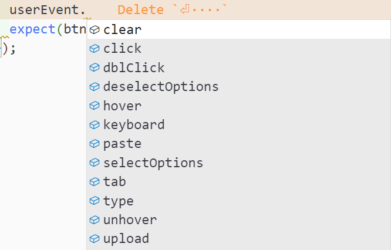
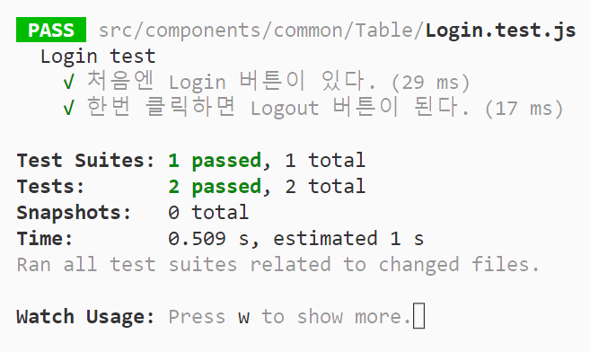
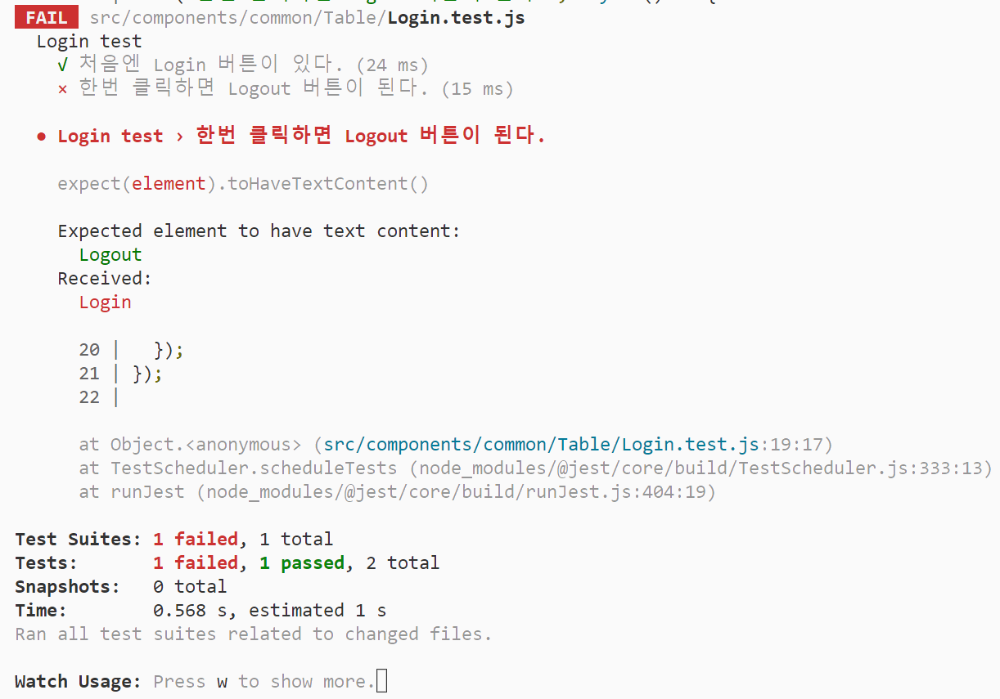

## fireEvent VS userEvent

리액트 컴포넌트를 테스트할 때 마우스 클릭, 키 입력 등 여러 유저 이벤트를 발생시킬 수 있다.   
이를 위해서는 Testing Library에 내장되어 있는 **fireEvent**를 사용하거나, fireEvent로 만든 또다른 라이브러리인 **userEvent**를 사용해야 한다.

많은 개발자 분들이 fireEvent 보다 userEvent 를 사용하는 것을 권장하는데, 그 이유는 다음과 같다.

1. fireEvent 를 더 직관적이고 범용적으로 사용할 수 있도록 만든 것이 userEvent
2. userEvent는 마치 사람이 직접 브라우저 상에서 행동하는 것처럼, 연관된 유저 이벤트를 한번에 발생시킴
   <br><small>- 예를 들어, 엘리먼트에 데이터를 입력할 땐 change 이벤트 뿐 아니라 focus, keydown, keyup 등 다양한 이벤트가 동반되어야 하지만, fireEvent 는 이를 한번에 발생시키지 못함</small>
3. 사용이 더 간편하고, 사람의 행동에 가까운 좀 더 추상화된 함수명을 제공함

```js
// fireEvent 로 인풋 요소에 값 입력하기
fireEvent.change(email, { target: { value: "user@test.com" } });
fireEvent.change(password, { target: { value: "Test1234" } });
```

```js
// userEvent 로 인풋 요소에 값 입력하기
userEvent.type(email, "user@test.com");
userEvent.type(password, "Test1234");
```

그러므로 userEvent 로 이벤트를 발생시키는 방법에 대해 알아보려 한다.

## userEvent 라이브러리

`import userEvent from '@testing-library/user-event';`   
위와 같이 임포트해서 사용할 수 있다.

지원하는 이벤트는 다음과 같다.




### 사용 예시

테스트할 버튼 컴포넌트는 처음엔 'Login' 이라는 텍스트가 적혀있고, 클릭 시 'Logout' 과 'Login' 텍스트가 번갈아가며 나타나도록 구현했다고 가정한다.

#### Click 이벤트

> userEvent.click(element) 로 특정 엘리먼트를 클릭할 수 있다.

<div class="code-header">
	<span class="red btn"></span>
	<span class="yellow btn"></span>
	<span class="green btn"></span>
</div>

```js
import { render, screen } from '@testing-library/react';
import userEvent from '@testing-library/user-event';
import Login from './Login';

describe('Login test', () => {
  it('처음엔 Login 버튼이 있다.', () => {
    render(<Login />);
    const btn = screen.getByRole('button');
    expect(btn).toHaveTextContent('Login');
  });

  it('한번 클릭하면 Logout 버튼이 된다.', () => {
    render(<Login />);
    const btn = screen.getByRole('button');

    userEvent.click(btn); // 클릭 이벤트 발생
    expect(btn).toHaveTextContent('Logout');
  });
});
```




두번 클릭 시 텍스트가 다시 바뀌므로 테스트에 실패한다.

<div class="code-header">
	<span class="red btn"></span>
	<span class="yellow btn"></span>
	<span class="green btn"></span>
</div>

```js
import { render, screen } from '@testing-library/react';
import userEvent from '@testing-library/user-event';
import Login from './Login';

describe('Login test', () => {
  it('처음엔 Login 버튼이 있다.', () => {
    render(<Login />);
    const btn = screen.getByRole('button');
    expect(btn).toHaveTextContent('Login');
  });

  it('한번 클릭하면 Logout 버튼이 된다.', () => {
    render(<Login />);
    const btn = screen.getByRole('button');

    userEvent.click(btn);
    userEvent.click(btn);
    expect(btn).toHaveTextContent('Logout');
  });
});
```



#### Keyboard 이벤트

> userEvent.tab() 으로 키보드에서 tab을 누르거나, userEvent.keyboard('key') 로 파라미터에 해당하는 키를 누를 수 있다.

<div class="code-header">
	<span class="red btn"></span>
	<span class="yellow btn"></span>
	<span class="green btn"></span>
</div>

```js
describe('Login test', () => {
  it('tab, space, enter 동작', () => {
    render(<Login />);
    const btn = screen.getByRole('button');

    userEvent.tab(); // tab으로 버튼에 focus 되도록 함
    userEvent.keyboard(' '); // space 키를 눌러서 버튼 클릭
    userEvent.keyboard('{Enter}'); // enter 키를 눌러서 버튼 클릭
    expect(btn).toHaveTextContent('Logout');
  });
});
```

### Type 이벤트

> userEvent.type() 으로 input 요소에 값을 입력할 수 있다.

테스트할 Form 컴포넌트는 이메일 입력란과 비밀번호 입력란, 로그인 버튼으로 구성되어 있으며, 로그인 버튼은 이메일과 비밀번호가 입력되었을 때만 활성화가 된다고 가정한다.

<div class="code-header">
	<span class="red btn"></span>
	<span class="yellow btn"></span>
	<span class="green btn"></span>
</div>

```js
import React from 'react';
import { render, screen } from '@testing-library/react';
import userEvent from '@testing-library/user-event';
import LoginForm from './LoginForm';

test('enables button when both email and password are entered', () => {
  render(<LoginForm />);

  const email = screen.getByLabelText('이메일');
  const password = screen.getByLabelText('비밀번호');
  const button = screen.getByRole('button');

  expect(button).toBeDisabled(); // 버튼이 비활성화 상태인지 검증

	// 각 input 요소에 값 타이핑
  userEvent.type(email, 'user@test.com');
  userEvent.type(password, 'Test1234');

  expect(button).toBeEnabled(); // 버튼이 활성화 상태인지 검증
});

```

## 참고 자료

- [[코딩앙마 유튜브] React Testing Library #5 유저 이벤트 테스트](https://www.youtube.com/watch?v=Vrn98_6B-fo)
- [[DaleSeo 블로그] 유저 이벤트 테스트 (@testing-library/user-event)](https://www.daleseo.com/testing-library-user-agent/)