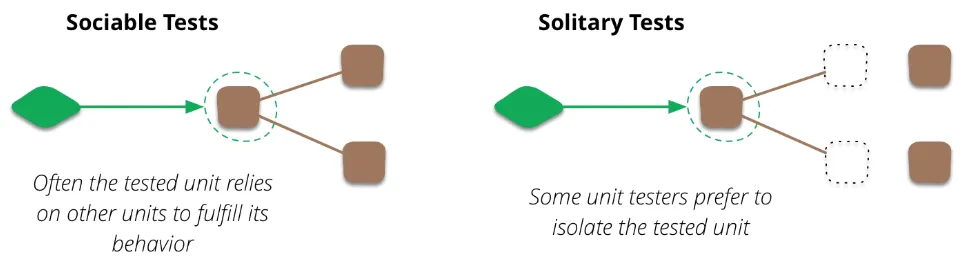
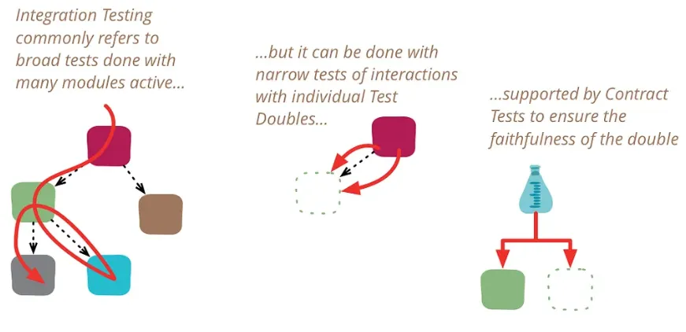
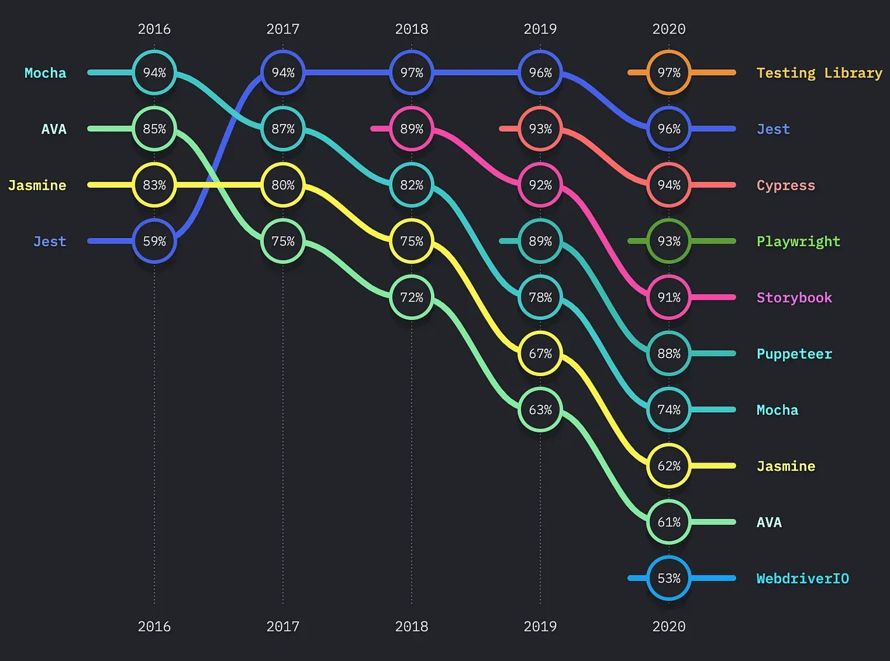

## 테스트에 대해 알아본 이유

매번 테스트코드니 TDD 니 이런 개념을 공부할 때마다 프론트는 해당이 되지 않는 것 같다는 생각이 들었고, 무엇을 어떻게 테스트해야 하는 건지도 몰랐다. 그래서 프론트엔드 개발자는 어쩔수 없이 브라우저에서 하나하나 직접 살펴보고 클릭하고 입력해 가면서 테스트를 해야 하는 줄로만 알았다. 실제로도 계속 그런 식으로 업무를 하고 있었고..🥲   
그러다보니 개발하는 시간보다 테스트하는 시간이 더 오래 걸릴 정도로 테스트에 너무 많은 시간을 소비하곤 했고, 업무 시간을 비효율적으로 쓰게 되었다.   
그러다 프론트엔드에서도 테스트 코드를 작성한다는 것을 알게 되었고, 리액트에서 테스트 코드를 작성하는 법을 알아보다가 테스트의 개념을 먼저 정리할 필요가 있어보여서 게시글을 쓰게 되었다.

이번 포스팅에선 프론트엔드에서 쓰이는 테스팅 기법에 대해 설명하고, 테스트 코드 작성 예시는 이후에 개별 포스팅으로 자세히 다룰 예정이다.

## 프론트엔드 테스트의 필요성

### 리팩토링이 용이함

위에서 말한 것처럼 기능 추가, 변경 등을 할 때마다 개발자가 직접 일일이 테스트하는 것은 매우 비효율적이고 안전하지도 못하다. 코드에서 중요한 부분은 테스트 코드를 실행시킴으로써 효율적이고 안전하게 테스트를 할 수 있다.

### 코드 품질과 개발 생산성이 향상됨

테스트를 통해 코드의 견고함을 확인하고, 버그를 사전에 찾아낼 수 있다.   
또한 테스트 코드를 작성하면서 코드를 이해하는데 도움이 되고, 다른 개발자들과의 협업을 원활하게 할 수 있다.

## 테스트의 종류

### 정적 테스트(Static Test)

> 코드를 실행시키지 않고 테스트를 하는 것

Type 에러나 Reference 에러와 같이 개발자의 실수로 인해 발생하는 에러를 방지할 수 있으며,   
더 좋은 코드를 작성하는 습관을 기르는데 도움을 준다.

ESLint 와 Typescript 가 이에 해당한다.

### 단위테스트(Unit Test)

> 개별적인 기능, 함수, 컴포넌트 등 작은 단위를 독립적으로 테스트하는 것

프론트엔드에서는 단일 컴포넌트나 단일 서비스가 단위가 될 수 있으며,   
**특정 컴포넌트를 렌더링해서 깨지지 않는지 확인하는 것**을 예로 들 수 있다.

또한 별도의 통합이 필요 없기 때문에 백엔드 API가 구현이 되어있지 않아도 작성할 수 있다.



<div class="source">출처: https://martinfowler.com/bliki/UnitTest.html</div>

- Sociable 테스트: 의존성이 있는 코드와 함께 테스트 (자식 컴포넌트를 포함해서 렌더링)
- Solitary 테스트: 의존성이 있는 코드를 모조품으로 대체하여 테스트 (자식 컴포넌트를 *모킹해서 렌더링)

<small>* 모킹(Mocking): 모조품을 만들어서 일단 코드가 돌아가게 하는 것</small>

소프트웨어의 구조가 명확하지 않고, 단일 유닛의 기능이 자주 변경되는 환경에서는 테스트가 자주 변경되어야 하며 이는 테스트 작성의 효율을 떨어뜨리기 때문에 이런 환경에서는 유닛 테스트를 추천하지 않는다.

### 통합테스트(Integration Test)

> 두개 이상의 모듈이 실제로 연결된 상태에서 올바르게 작동하는지 확인하는 테스트

유닛들 간의 데이터를 주고받는 환경을 테스트한다.   
프론트엔드 통합 테스트에선 **UI와 API 간의 상호작용이 올바르게 일어나는지**, **state에 따른 UI의 변경이 올바르게 동작하는지** 등을 확인할 수 있다.   
전략에 따라서 프론트엔드 전체 유닛들만 통합하여 테스트하거나, 백엔드와 DB 전체를 통합해서 테스트하는 경우도 있다.



<div class="source">출처: https://martinfowler.com/bliki/IntegrationTest.html</div>

- broad 테스트: 의존성이 있는 모든 모듈이 연결된 상태로 테스트
- narrow 테스트: 연결된 모듈을 모킹하여 테스트

UI와 API 간의 연결 테스트를 예로 들었을 때 broad test는 실제 API를 호출하여 테스트 하는것, narrow test는 API 클라이언트를 모킹하거나 가상 API 서버를 이용하여 테스트하는 것이라고 볼 수 있다.


### E2E 테스트(End-to-End Test)

> 실제 사용자의 입장에서 애플리케이션의 모든 부분이 잘 작동하는지 확인하는 테스트

End to End 라는 말 그대로, 소프트웨어의 가장 끝단과 끝단인 사용자로부터 백엔드 인프라까지 테스트하는 것을 의미하며, 프론트엔드에서는 **실제 브라우저를 실행해서 테스트**하는 것을 말한다.   
**사용자 관점에서 전체 시나리오를 테스트**하기 때문에, 코드의 변경에도 테스트를 변경할 필요가 없으며 소프트웨어의 무결성을 보장하기 가장 좋다.   
하지만 매우 많은 테스트가 필요하고, 시간이 오래 걸려서 자주 테스트하기는 어렵다. 또한 프론트엔드만 따로 테스트하는 것이 불가능하고 백엔드와의 통합이 필요하며, 네트워크 에러 등 실행 환경의 문제로 테스트가 실패할 수도 있다는 단점이 있다.

---

각각의 테스트는 따로 사용하기도, 같이 사용하기도 한다.   
특히 유닛 테스트와 통합 테스트는 **React-Testing-Library**와 같이 동시에 지원하는 툴이 많기 때문에 전략에 따라 섞어서 사용하기도 한다.


## 테스트 도구

### 단위 테스트

||장점|단점|
|---|---|---|
|**Jest**|- 설정이 쉬움, 병렬 테스트 실행을 지원함<br>- 모의(Mock) 기능이 강력함|- 큰 프로젝트에서 실행 속도가 느릴 수 있음|
|**Mocha**|- 유연한 설정, 각종 플러그인 지원|- 모의(Mock) 기능이 부족함<br>- 설정이 복잡할 수 있음|
|**Jasmine**|- BDD 스타일 테스트 작성<br>- 기본적인 모의(Mock) 기능 제공|- 실행 속도가 상대적으로 느림<br>- 병렬 테스트 미지원|

- 공식 사이트
	- [Jest](https://jestjs.io/)
	- [Mocha](https://mochajs.org/)
	- [Jasmine](https://jasmine.github.io/index.html)

### 통합 테스트

||장점|단점|
|---|---|---|
|**Jest**|- 단위테스트와 같은 설정을 사용하여 일관성 유지|- 리액트 외의 프로젝트에서 통합 테스트 설정이 복잡할 수 있음|
|**Cypress**|- 시각적인 테스트 실행 환경 제공<br>- 설정이 간단함|- E2E 테스트에 주로 사용되어 통합 테스트를 위한 기능이 부족할 수 있음|

### E2E 테스트

||장점|단점|
|---|---|---|
|**Cypress**|- 사용하기 쉬운 API<br>- 빠른 테스트 실행 속도, 실시간 디버깅 지원|- 크로스 브라우저 테스트 지원이 미흡함|
|**Selenium**|- 다양한 프로그래밍 언어 지원<br>- 크로스 브라우저 테스트 지원|- 테스트 작성과 유지보수가 어려움<br>- 실행 속도가 느림|
|**Puppeteer**|- 크롬 브라우저에서 빠른 테스트 실행<br>- Headless 브라우저 지원|- 크로스 브라우저 테스트 미지원<br>- API가 복잡할 수 있음|

- 공식 사이트
	- [Cypress](https://www.cypress.io/)
	- [Selenium](https://www.selenium.dev/)
	- [Puppeteer](https://pptr.dev/)

---

위에서 서술하진 않았지만 가장 많이 쓰이는 테스팅 툴은 **React Testing Library**이며, 그 다음으로 **Jest**가 많이 사용된다. React Testing Library는 다른 테스트 프레임워크와 동시 사용이 가능하며, 그 중 Jest와 함께 사용하는 것이 권장되는 조합이다. 이는 Jest가 React 와 밀접하게 통합되어 있고, Facebook 에서 동시에 관리하고 있기 때문이다.



<div class="source">2020 테스트도구의 만족도 기준 순위 (출처: https://2020.stateofjs.com/ko-KR/technologies/testing/)</div>


## Jest 란?

> 페이스북에서 개발한 자바스크립트 테스트 프레임워크 (리액트 프로젝트에서 주로 사용)

### 제공 기능

- 테스트 실행기
- 단언(assertion) 라이브러리
- mock 함수, 코드 커버리지 도구 등

### 특징 및 장점

- **다양한 환경에서 테스트 가능**: 프론트엔드 뿐 아니라 Node.js 환경에 구축된 백엔드 애플리케이션도 테스트 가능
- **간편한 설정**: 설정이 쉽고 기본값이 잘 구성되어 있어, 프로젝트에 빠르게 도입할 수 있다.
- **빠른 테스트 실행**: 병렬 테스트 실행이 가능하며, 변경된 파일에 대해서만 테스트를 실행할 수 있어 빠른 테스트를 지원한다.
- **모의(Mock) 기능**: 함수, 모듈, API 등을 손쉽게 모킹할 수 있어 단위 테스트 작성을 편리하게 한다.

### 사용 예시

사칙연산 함수들을 테스트하는 간단한 예시이다.

<div class="code-header">
	<span class="red btn"></span>
	<span class="yellow btn"></span>
	<span class="green btn"></span>
</div>

```javascript
// 구현 코드 (calculator.js)
function add(a, b) {
  return a + b;
}

function subtract(a, b) {
  return a - b;
}

function multiply(a, b) {
  return a * b;
}

function divide(a, b) {
  if (b === 0) {
    throw new Error("Cannot divide by zero");
  }
  return a / b;
}

module.exports = { add, subtract, multiply, divide };
```

<div class="code-header">
	<span class="red btn"></span>
	<span class="yellow btn"></span>
	<span class="green btn"></span>
</div>

```javascript
// 테스트 코드 (calculator.test.js)
const { add, subtract, multiply, divide } = require('./calculator');

test('adds 1 + 2 to equal 3', () => {
  expect(add(1, 2)).toBe(3);
});

test('subtracts 5 - 2 to equal 3', () => {
  expect(subtract(5, 2)).toBe(3);
});

test('multiplies 2 * 3 to equal 6', () => {
  expect(multiply(2, 3)).toBe(6);
});

test('divides 6 / 2 to equal 3', () => {
  expect(divide(6, 2)).toBe(3);
});

test('throws an error when dividing by zero', () => {
  expect(() => divide(6, 0)).toThrowError('Cannot divide by zero');
});
```

test 함수를 사용하여 테스트 케이스를 정의하고, expect 와 toBe / toThrowError 를 사용하여 결과를 검증한다.

이후, 터미널에서 'jest' 명령어를 실행하여 테스트를 실행할 수 있다.

<div class="code-header">
	<span class="red btn"></span>
	<span class="yellow btn"></span>
	<span class="green btn"></span>
</div>

```bash
$ jest
```

테스트가 성공적으로 통과되면, 터미널에 아래와 같은 결과가 출력된다.

```bash
PASS  ./calculator.test.js
  ✓ adds 1 + 2 to equal 3 (5ms)
  ✓ subtracts 5 - 2 to equal 3 (1ms)
  ✓ multiplies 2 * 3 to equal 6 (1ms)
  ✓ divides 6 / 2 to equal 3 (1ms)
  ✓ throws an error when dividing by zero (2ms)

Test Suites: 1 passed, 1 total
Tests:       5 passed, 5 total
Snapshots:   0 total
Time:        1.357s
```

## React Testing Library 란?

> 리액트 컴포넌트 테스트를 위한 라이브러리

2018년에 처음 등장해서 지금까지 개발되고 있는 테스팅 도구들의 집합체이며, __*사용자 관점에서 UI를 테스트__ 할 수 있게 도와준다.   
테스트 실행기나 단언 라이브러리를 포함하고 있지는 않아서, Jest와 같은 테스트 프레임워크와 함께 사용해야 한다.

<small>
	* 기존 프론트엔드 테스트는 기능 그 자체보다는 컴포넌트 내부 상태 변경과 같은 상세한 구현을 테스트하여, 개발 속도를 저하시키고 생산성을 떨어뜨리는 문제가 있었다. 이러한 문제를 개선하기 위해 등장한 것이 테스팅 라이브러리이다.<br><br>
	사용자는 컴포넌트 내부의 상태가 어떻게 바뀌고, 내부 메서드가 어떻게 호출되는지 등에 대해 전혀 관심이 없기 때문에 테스트 코드를 작성할 때도 이에 대해선 테스트하지 말자는 입장으로 테스팅 라이브러리가 개발되었다.<br><br>
	이러한 접근 방식은 내부 구현을 수정할 때 테스트가 깨지지 않게 함으로써 리팩토링을 더욱 수월하게 해준다.
</small>

### 제공 기능

- 리액트 컴포넌트를 가상으로 렌더링하여 동작을 확인하고 렌더링 결과를 확인 가능
- DOM 요소를 선택하고, 이벤트를 발생시키는 데 필요한 유틸리티 함수를 제공

### 특징 및 장점

- **사용자 중심의 테스트**: 사용자가 직접 경험하는 것과 유사한 방식으로 테스트를 작성할 수 있다.
- **컴포넌트에 직접 접근하지 않음**: 컴포넌트의 내부 구현을 알 필요 없이 테스트를 작성할 수 있어 견고한 테스트를 작성할 수 있다.

### 사용 예시

버튼 클릭 시 텍스트가 변경되는 컴포넌트를 테스트하는 예시이다.

<div class="code-header">
	<span class="red btn"></span>
	<span class="yellow btn"></span>
	<span class="green btn"></span>
</div>

```jsx
// 컴포넌트 (ButtonWithText.js)
import React, { useState } from 'react';

function ButtonWithText() {
  const [text, setText] = useState('Hello, world!');

  const handleClick = () => {
    setText('You clicked the button!');
  };

  return (
    <div>
      <p data-testid="text">{text}</p>
      <button data-testid="button" onClick={handleClick}>
        Click me!
      </button>
    </div>
  );
}

export default ButtonWithText;
```

<div class="code-header">
	<span class="red btn"></span>
	<span class="yellow btn"></span>
	<span class="green btn"></span>
</div>

```javascript
// 테스트 코드 (ButtonWithText.test.js)
import React from 'react';
import { render, fireEvent } from '@testing-library/react';
import ButtonWithText from './ButtonWithText';

test('renders initial text and changes it when button is clicked', () => {
  const { getByTestId } = render(<ButtonWithText />);
  const textElement = getByTestId('text');
  const buttonElement = getByTestId('button');

  expect(textElement.textContent).toBe('Hello, world!');

  fireEvent.click(buttonElement);

  expect(textElement.textContent).toBe('You clicked the button!');
});
```

위의 코드에서는 render 함수로 컴포넌트를 렌더링하고, fireEvent 함수를 사용하여 버튼 클릭 이벤트를 시뮬레이션한다. 그리고 expect를 사용하여 텍스트의 내용이 변경되는지 검증한다.

여기서도 마찬가지로 'jest' 명령어로 테스트를 실행 가능하다.   
테스트가 성공적으로 통과되면 터미널에 아래와 같은 결과가 출력된다.

```bash
PASS  ./ButtonWithText.test.js
  ✓ renders initial text and changes it when button is clicked (32ms)

Test Suites: 1 passed, 1 total
Tests:       1 passed, 1 total
Snapshots:   0 total
Time:        1.964s
```

### 공식 사이트

[Testing Library](https://testing-library.com/)

## 기본적인 테스팅 전략: Given When Then 패턴

테스트 시나리오를 작성할 때 주로 사용되는 패턴으로,

1. **Given**: 주어진 조건에 대한 코드를 작성 (테스트할 데이터나 컴포넌트를 초기화하는 로직 등)
2. **When**: 테스트할 행동에 대한 코드 작성
3. **Then**: 테스트 검증 로직에 대한 코드 작성

데이터가 주어지고 어떤 동작을 했을때 어떤 결과가 나오는지에 대해 기술해야 한다.

<div class="code-header">
	<span class="red btn"></span>
	<span class="yellow btn"></span>
	<span class="green btn"></span>
</div>

```js
// given
const a = 1;
const b = 2;

// when
const result = plus(a,b);

// then
assert result === 3;
```

여기서, `then` 부분에는 반드시 어떤 로직을 담아서는 안되고 상수 값으로 기술해야 한다.

```js
// 안좋은 테스트 예시
assert result === a + b;
```

<small> "1+2 는 무엇인가" 라는 문제를 풀다가 답안지를 봤는데, "정답은 1+2 이다." 라고 나와있으면 얼마나 어이없을지를 생각해보면 될 것 같다.. </small>

아래는 Given When Then 전략을 React Testing Library 에 적용한 예시이다.

<div class="code-header">
	<span class="red btn"></span>
	<span class="yellow btn"></span>
	<span class="green btn"></span>
</div>

```jsx
import {render, screen} from '@testing-library/react'
import userEvent from '@testing-library/user-event'
import '@testing-library/jest-dom'
import Fetch from './fetch'

test('loads and displays greeting', async () => {
  // Given 
  // 컴포넌트를 랜더링
  render(<Fetch url="/greeting" />)

  // When
  // Load Greeting 글씨를 찾아서 클릭
  await userEvent.click(screen.getByText('Load Greeting'))

  // Then
  // heading에 hello there이 있는지 검증
  expect(screen.getByRole('heading')).toHaveTextContent('hello there')
})
```

---

[이후 포스팅](https://cheeseb.github.io/testing/react-testing-with-jest-and-rtl/)에서는 Jest와 React Testing Library를 사용해서 리액트 테스트 코드를 작성하는 기본적인 예시를 다룰 예정이다.


## 참고 링크

- [React 공식 문서](https://react.dev/)
- [React Testing Library 공식 문서](https://testing-library.com/docs/react-testing-library/intro/)
- [Jest 공식 문서](https://jestjs.io/docs/getting-started)
- [콴다 팀블로그 - 모던 프론트엔드 테스트 전략](https://blog.mathpresso.com/%EB%AA%A8%EB%8D%98-%ED%94%84%EB%A1%A0%ED%8A%B8%EC%97%94%EB%93%9C-%ED%85%8C%EC%8A%A4%ED%8A%B8-%EC%A0%84%EB%9E%B5-1%ED%8E%B8-841e87a613b2)
- [couchcoding.log - 프론트엔드 테스트 해야할까?](https://velog.io/@couchcoding/%ED%94%84%EB%A1%A0%ED%8A%B8%EC%97%94%EB%93%9C-%ED%85%8C%EC%8A%A4%ED%8A%B8-%EC%96%B4%EB%96%BB%EA%B2%8C-%ED%95%B4%EC%95%BC%ED%95%A0%EA%B9%8Cwith-react-testing-library)
- [leehyunho2001.log - 테스트를 처음 공부하는 프론트엔드 개발자의 개념 다지기](https://velog.io/@leehyunho2001/%ED%85%8C%EC%8A%A4%ED%8A%B8%EB%A5%BC-%EC%B2%98%EC%9D%8C-%EA%B3%B5%EB%B6%80%ED%95%98%EB%8A%94-%ED%94%84%EB%A1%A0%ED%8A%B8%EC%97%94%EB%93%9C-%EA%B0%9C%EB%B0%9C%EC%9E%90%EC%9D%98-%EA%B0%9C%EB%85%90-%EB%8B%A4%EC%A7%80%EA%B8%B0)