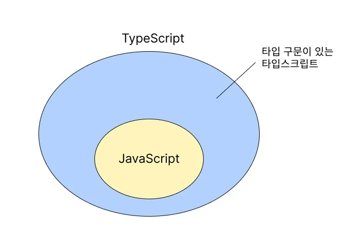
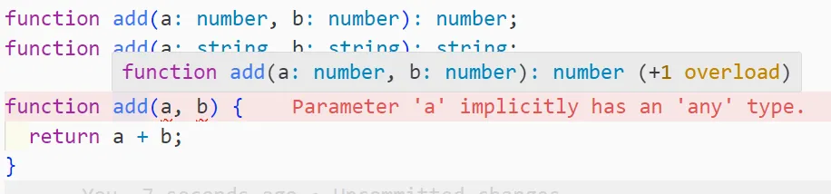

## 아이템 1. 타입스크립트와 자바스크립트의 관계 이해하기

### 타입스크립트는 자바스크립트의 상위 집합이다.



모든 자바스크립트 프로그램은 타입스크립트이기 때문에, .js를 .ts 로 바꿔도 달라지는 것은 없다. (타입 체크에 걸리는 것과는 무관) 이는 자바스크립트를 타입스크립트로 migration 하는 데에 큰 이점이 된다.

반면에, 모든 타입스크립트가 자바스크립트인 것은 아니다. 이것은 타입을 명시하는 추가적인 문법이 있기 때문이다.

### 타입스크립트는 런타임에 오류가 날 코드를 미리 찾아낸다.

타입 체커가 모든 오류를 찾아내지는 못하지만, 상당히 많은 오류를 미연에 방지할 수 있다.
또한 오류가 발생하지 않더라도 의도와 다르게 동작하는 코드를 찾아내는 경우도 있다.

<div class="code-header">
	<span class="red btn"></span>
	<span class="yellow btn"></span>
	<span class="green btn"></span>
</div>

```ts
const states = [
  {name: 'Alabama', capital: 'Montgomery'},
  {name: 'Alaska',  capital: 'Juneau'},
  {name: 'Arizona', capital: 'Phoenix'},
];

for (const state of states) {
  console.log(state.capitol);
                 // ~~~~~~~ Property 'capitol' does not exist on type
                 //         '{ name: string; capital: string; }'.
                 //         Did you mean 'capital'?
}
```

타입스크립트는 타입 구문 없이도 오류를 잡을 수 있지만, 타입 구문을 추가한다면 더 많은 오류를 찾아낼 수 있으며 코드의 의도를 더 잘 파악할 수 있다.

<div class="code-header">
	<span class="red btn"></span>
	<span class="yellow btn"></span>
	<span class="green btn"></span>
</div>

```ts
// Before
const states = [
  {name: 'Alabama', capitol: 'Montgomery'},
  {name: 'Alaska',  capitol: 'Juneau'},
  {name: 'Arizona', capitol: 'Phoenix'},
];
for (const state of states) {
  console.log(state.capital);
                 // ~~~~~~~ Property 'capital' does not exist on type
                 //         '{ name: string; capitol: string; }'.
                 //         Did you mean 'capitol'?
}
```

<div class="code-header">
	<span class="red btn"></span>
	<span class="yellow btn"></span>
	<span class="green btn"></span>
</div>

```ts
// After
interface State {
  name: string;
  capital: string;
}

const states: State[] = [
  {name: 'Alabama', capitol: 'Montgomery'},
                 // ~~~~~~~~~~~~~~~~~~~~~
  {name: 'Alaska',  capitol: 'Juneau'},
                 // ~~~~~~~~~~~~~~~~~
  {name: 'Arizona', capitol: 'Phoenix'},
                 // ~~~~~~~~~~~~~~~~~~ Object literal may only specify known
                 //         properties, but 'capitol' does not exist in type
                 //         'State'.  Did you mean to write 'capital'?
];
for (const state of states) {
  console.log(state.capital);
}
```

### 타입스크립트는 기본적으로는 자바스크립트의 런타임 동작을 모델링한다.

자바스크립트 런타임에 에러가 나지 않는 코드는 타입스크립트에서도 정상으로 인식한다.

```ts
const x = 2 + '3';  // OK, type is string
const y = '2' + 3;  // OK, type is string
```

하지만 반대로, 정상 동작하는 코드에 오류를 표시하기도 한다. 이는 단순히 런타임 동작을 모델링하는 것 뿐 아니라 의도치 않은 이상한 코드가 오류로 이어질 수 있다는 것까지 고려한 경우이다.

```ts
const a = null + 7;  // Evaluates to 7 in JS
       // ~~~~ Operator '+' cannot be applied to types ...
const b = [] + 12;  // Evaluates to '12' in JS
       // ~~~~~~~ Operator '+' cannot be applied to types ...
alert('Hello', 'TypeScript');  // alerts "Hello"
            // ~~~~~~~~~~~~ Expected 0-1 arguments, but got 2
```

작성된 프로그램이 타입 체크를 통과하더라도 런타임에 오류가 발생할 수 있다. 이는 타입스크립트가 이해하는 값의 타입과 실제 값에 차이가 있을 수 있기 때문이다.

## 아이템 2. 타입스크립트 설정 이해하기

타입스크립트 설정은 가급적 tsconfig.json 을 통해서 설정하는 것이 좋으며, 언어에 영향을 미치는 설정 중 noImplicitAny 와 strictNullCheck 가 가장 중요하다. 만약 strict 설정을 true 로 한다면 이 두가지를 포함한 여러 엄격한 검사를 수행하여 대부분의 오류를 잡아낼 수 있다.

### noImplicitAny

> 변수들이 미리 정의된 타입을 가져야 하는지 여부를 제어한다.

noImplicitAny를 true로 설정한다면 말 그대로 변수가 암시적으로 any 값을 가지지 못하게 한다. (명시적으로 any를 설정한다면 통과하겠지만 그렇게 쓰지 않는것을 권장한다.)

<div class="code-header">
	<span class="red btn"></span>
	<span class="yellow btn"></span>
	<span class="green btn"></span>
</div>

```ts
// tsConfig: {"noImplicitAny":true}

function add(a, b) {
          // ~    Parameter 'a' implicitly has an 'any' type
          //    ~ Parameter 'b' implicitly has an 'any' type
  return a + b;
}

function subtract(a:number, b:number) {
  return a - b;
}
```

타입스크립트는 타입 정보를 가질 때 가장 효과적이므로 되도록 noImplicitAny를 설정해야 하며,   
자바스크립트를 타입스크립트로 전환하는 과정에서만 noImplicitAny를 잠깐 해제해 두는 것이 좋다.

### strictNullChecks

> null과 undefined가 모든 타입에서 허용되도록 할지 여부를 제어한다.

<div class="code-header">
	<span class="red btn"></span>
	<span class="yellow btn"></span>
	<span class="green btn"></span>
</div>

```ts
// tsConfig: {"noImplicitAny":true,"strictNullChecks":true}

const x: number = null;
//    ~ Type 'null' is not assignable to type 'number'
```

이는 명시적으로 null 을 허용하도록 하거나, null을 허용하지 않으려면 null을 체크하는 코드를 추가해야 한다.

<div class="code-header">
	<span class="red btn"></span>
	<span class="yellow btn"></span>
	<span class="green btn"></span>
</div>


```ts
	const x: number | null = null;

  const el = document.getElementById('status');
  el.textContent = 'Ready';
//~~ Object is possibly 'null'

  if (el) {
    el.textContent = 'Ready';  // OK, null has been excluded
  }
  el!.textContent = 'Ready';  // OK, we've asserted that el is non-null
```

이 설정은 'undefined는 객체가 아닙니다' 와 같은 런타임 오류를 방지해주기 때문에 true 로 하는 것이 좋다.
이 설정도 noImplicitAny 와 마찬가지로 자바스크립트를 마이그레이션 하는 중에만 해제하는 것을 권장한다.

---

tsconfig 의 다른 옵션들은 [Typescript Guidebook](https://yamoo9.gitbook.io/typescript/cli-env/tsconfig) 에서 확인할 수 있다.

## 아이템 3. 코드 생성과 타입이 관계없음을 이해하기

타입스크립트 컴파일러는 두가지 역할을 수행한다.

- 코드의 타입 오류를 체크
- 최신 타입스크립트/자바스크립트 를 구버전의 자바스크립트로 변환

이 두가지는 서로 완벽히 독립적이며, 자바스크립트로 컴파일되는 과정에서 타입 관련된 코드(인터페이스, 타입, 타입 구문)는 모두 제거된다. 그러므로 타입 오류를 체크하는 것이 자바스크립트의 컴파일이나 실행에 영향을 주지 못한다. 이로 인해 타입스크립트는 다음과 같은 특징을 갖는다.

### 1. 타입 오류가 있는 코드도 컴파일이 가능하다.

하지만 tsconfig에 noEmitOnError 를 설정하면 오류가 있을때 컴파일하지 않는다.

### 2 .런타임에는 타입 체크가 불가능하다.

위에서 설명하듯이, 타입 체크는 런타임에 아무 영향을 주지 못한다.

<div class="code-header">
	<span class="red btn"></span>
	<span class="yellow btn"></span>
	<span class="green btn"></span>
</div>

```ts
interface Square {
  width: number;
}

interface Rectangle extends Square {
  height: number;
}

type Shape = Square | Rectangle;

function calculateArea(shape: Shape) {
  if (shape instanceof Rectangle) {
                  // ~~~~~~~~~ 'Rectangle' only refers to a type, but is being used as a value here
    return shape.width * shape.height;
                    		//        ~~~~~~ Property 'height' does not exist on type 'Shape'
  } else {
    return shape.width * shape.width;
  }
}
```

위 예시에서 instanceof 는 런타임 연산이지만 Rectangle은 타입이므로 에러가 발생하며, if문이 제 역할을 하지 못한다.

이럴 때 런타임에 타입 정보를 유지할 수 있는 방법이 있다.

#### 속성의 존재 여부 체크

<div class="code-header">
	<span class="red btn"></span>
	<span class="yellow btn"></span>
	<span class="green btn"></span>
</div>

```ts
function calculateArea(shape: Shape) {
  if ('height' in shape) {
    return shape.width * shape.height;
  } else {
    return shape.width * shape.width;
  }
}
```

속성 체크는 런타임 값에 관련되지만 타입 체커 또한 shape의 타입을 Rectangle로 보정해 준다.

#### 태그된 유니온 사용

<div class="code-header">
	<span class="red btn"></span>
	<span class="yellow btn"></span>
	<span class="green btn"></span>
</div>

```ts
interface Square {
  kind: 'square';
  width: number;
}

interface Rectangle {
  kind: 'rectangle';
  height: number;
  width: number;
}

type Shape = Square | Rectangle;

function calculateArea(shape: Shape) {
  if (shape.kind === 'rectangle') {
    return shape.width * shape.height;
  } else {
    return shape.width * shape.width;
  }
}
```

여기서 kind 속성이 태그가 되며, 태그를 이용하여 분기 처리를 한다.

#### 타입을 클래스로 만들기

<div class="code-header">
	<span class="red btn"></span>
	<span class="yellow btn"></span>
	<span class="green btn"></span>
</div>

```ts
class Square {
  constructor(public width: number) {}
}

class Rectangle extends Square {
  constructor(public override width: number, public height: number) {
    super(width);
  }
}

type Shape = Square | Rectangle; // 타입으로 사용

function calculateArea(shape: Shape) {
  if (shape instanceof Rectangle) { // 값으로 사용
    return shape.width * shape.height;
  } else {
    return shape.width * shape.width;
  }
}
```

클래스는 타입으로도, 값으로도 사용 가능하므로 타입 오류도 해결되고 instanceof 연산도 제 역할을 한다.

### 3. 타입 연산은 런타임에 영향을 주지 않는다.


<div class="code-header">
	<span class="red btn"></span>
	<span class="yellow btn"></span>
	<span class="green btn"></span>
</div>

```ts
// ts
function asNumber(val: number | string): number {
  return val as number;
}

// 컴파일 후의 js
function asNumber(val) {
  return val;
}
```

위 타입스크립트 코드는 number 혹은 string 타입의 매개변수를 number 형식으로 정제해서 리턴하려는 의도를 가지고 있지만, as Number는 타입 체커를 통과하기 위한 타입 연산일 뿐 런타임에서 값에 적용하지 못한다.

위 코드는 아래와 같이 수정해야 제대로 동작한다.


<div class="code-header">
	<span class="red btn"></span>
	<span class="yellow btn"></span>
	<span class="green btn"></span>
</div>

```ts
function asNumber(val: number | string): number {
  return typeof(val) === 'string' ? Number(val) : val;
}
```

### 4. 런타임 타입은 선언된 타입과 다를 수 있다.

타입스크립트의 선언된 타입과 실제 런타임에서의 타입이 맞지 않을 수 있다는 것을 항상 염두에 두어야 한다.

<div class="code-header">
	<span class="red btn"></span>
	<span class="yellow btn"></span>
	<span class="green btn"></span>
</div>

```ts
function turnLightOn() {}
function turnLightOff() {}

function setLightSwitch(value: boolean) {
  switch (value) {
    case true:
      turnLightOn();
      break;
    case false:
      turnLightOff();
      break;
    default:
      console.log('이 부분이 실행될 수 있을까?');
  }
}
```

위 코드를 예시로 든다면, 만약 개발 도중 setLightSwitch 함수에 boolean 외의 다른 값을 넣어 호출하려 한다면 에러를 표시할 것이다. 하지만 런타임에 그 외의 값이 들어오지 않을 거라는 보장을 하진 못한다. 아래의 예시처럼 네트워크 호출로 받아온 값을 사용할 때가 그런 경우이다.


<div class="code-header">
	<span class="red btn"></span>
	<span class="yellow btn"></span>
	<span class="green btn"></span>
</div>

```ts
interface LightApiResponse {
  lightSwitchValue: boolean;
}

async function setLight() {
  const response = await fetch('/light');
  const result: LightApiResponse = await response.json();
  setLightSwitch(result.lightSwitchValue);
}
```

이러한 경우에는 타입 선언을 했더라도 실제로 런타임에 네트워크에서는 다른 타입의 값을 넘겨줄 수 있으며, 타입스크립트가 이를 미리 알 수는 없다.

이렇게 타입 선언을 제대로 했더라도 런타임 시 예외 상황이 발생할 수 있으므로 타입스크립트에만 너무 의지하지 않고 항상 별도의 예외 처리를 해 주는 것이 좋을 것 같다.

### 5. 타입스크립트 타입으로는 함수를 오버로드 할 수 없다.

> **오버로딩**: <br> 한 모듈 안에 동일한 이름의 함수가 있더라도 매개변수의 개수나 타입이 다르면 사용이 가능한 것 <br> <small>(오버라이딩: 부모 클래스에서 상속받은 메서드를 자식 클래스에서 재정의하는 것)</small>

자바나 C++ 같은 언어는 함수 오버로딩이 가능하지만, 타입스크립트는 타입과 런타임이 무관하기 때문에 오버로딩이 불가능하다.

<div class="code-header">
	<span class="red btn"></span>
	<span class="yellow btn"></span>
	<span class="green btn"></span>
</div>

```ts
function add(a: number, b: number) { return a + b; }
      // ~~~ Duplicate function implementation
function add(a: string, b: string) { return a + b; }
      // ~~~ Duplicate function implementation
```

하나의 함수에 여러 선언문을 작성하여 여러 타입 정보를 제공하는 것은 가능하지만(타입 수준의 오버로딩), 실제 구현체는 오직 하나만 존재한다.

<div class="code-header">
	<span class="red btn"></span>
	<span class="yellow btn"></span>
	<span class="green btn"></span>
</div>

```ts
function add(a: number, b: number): number;
function add(a: string, b: string): string;

function add(a, b) {
  return a + b;
}

const three = add(1, 2);
const twelve = add('1', '2');
```



이러한 스타일의 오버로딩 사용 시, 위와 같이 타입 에러가 발생하므로 tsconfig에서 noImplicitAny를 false로 지정해 주어야 한다.

### 6. 타입스크립트 타입은 런타임 성능에 영향을 주지 않는다.

타입스크립트 컴파일러가 빌드타임 오버헤드가 있을 뿐, 타입스크립트의 타입은 런타임에 비용이 전혀 들지 않는다.

## 아이템 4. 구조적 타이핑에 익숙해지기

<small>만약 어떤 새가 오리처럼 걷고, 헤엄치고, 꽥꽥거리는 소리를 낸다면 나는 그 새를 오리라고 부를 것이다. - 덕 테스트</small>

자바스크립트는 덕 타이핑 기반이다. 여기서 덕 타이핑이란 **어떤 함수에서 필요한 매개변수 값만 모두 제대로 주어진다면, 다른 것은 신경쓰지 않고 사용하는 것**이다. 타입스크립트 또한 이것을 적용하기 위해 구조적 타이핑을 사용한다.

### 함수의 매개변수

```ts
interface Vector2D {
  x: number;
  y: number;
}

interface NamedVector {
	x: number;
  y: number;
  name: string;
}

function calculateLength(v: Vector2D) {
  return Math.sqrt(v.x * v.x + v.y * v.y);
}

const v: NamedVector = { x: 3, y: 4, name: 'Zee' };
calculateLength(v);  // OK, result is 5
```

위의 예시에서 NamedVector의 구조가 Vecter2D와 호환되기 때문에, 매개변수 타입을 Vecter2D로 명시했어도 NamedVector 를 사용해서 호출이 가능하다.

이러한 특성 때문에 예상치 못한 결과가 발생할 수 있다.

<div class="code-header">
	<span class="red btn"></span>
	<span class="yellow btn"></span>
	<span class="green btn"></span>
</div>

```ts
interface Vector3D {
  x: number;
  y: number;
  z: number;
}

function calculateLengthL1(v: Vector3D) {
  let length = 0;
  for (const axis of Object.keys(v)) {
    const coord = v[axis];
               // ~~~~~~~ Element implicitly has an 'any' type because ...
               //         'string' can't be used to index type 'Vector3D'
    length += Math.abs(coord);
  }
  return length;
}
```

이 예시에서, Object.keys 로 v의 키를 그대로 가져와서 접근하는 것임에도 에러가 뜨는 이유는,   
Vector3D에 명시한 것 외에도 v에는 어떤 속성이든 있을 수 있기 때문이다.   
그러므로 타입스크립트는 v\[axis\] 가 어떤 속성이 될지 알 수 없어서 number 타입이라고 확정할 수 없는 것이다.

```ts
const vec3D = {x: 3, y: 4, z: 1, address: '123 Broadway'};
calculateLengthL1(vec3D);  // OK, returns NaN
```

이런 경우에는 루프보단 모든 속성을 각각 더하는 것이 더 낫다.

```ts
function calculateLengthL1(v: Vector3D) {
  return Math.abs(v.x) + Math.abs(v.y) + Math.abs(v.z);
}
```

### 클래스 할당문

클래스도 마찬가지로 구조적 타이핑이 적용된다.

<div class="code-header">
	<span class="red btn"></span>
	<span class="yellow btn"></span>
	<span class="green btn"></span>
</div>

```ts
class C {
  foo: string;
  constructor(foo: string) {
    this.foo = foo;
  }
}

const c = new C('instance of C');
const d: C = { foo: 'object literal' };  // OK!
```

여기서 d가 C타입에 할당되는 이유는, d 또한 string 타입의 foo 속성을 가질 뿐 아니라 자바스크립트의 객체 특성 상 Object.prototype 으로부터 비롯된 생성자를 가지기 때문이다. 그러므로 필요한 속성과 생성자가 어쨌든 존재하기 때문에 할당이 가능한 것이다.

만약 C에 단순히 할당만 하는 것이 아닌 다른 로직이 존재한다면 오류가 발생할 것이다.

여기까지만 살펴보면 구조적 타이핑이 그저 골칫덩이로 보이지만, 유닛 테스트를 작성할 때 구조적 타이핑을 활용하면 더 쉽게 작성할 수 있고 라이브러리 간의 의존성을 완벽히 분리할 수 있다는 장점이 있다.

## 아이템 5. any 타입 지양하기

타입스크립트에서 any 타입을 쓰면 안되는 이유는 많다.

- 타입 안정성이 없고, 타입시스템의 신뢰도를 떨어뜨림
- 함수 시그니처를 무시함
- 타입 설계를 감춰버리고, 버그도 감춤
- 코드 편집기의 언어 서비스가 적용되지 않음
	- 자동완성, F2로 이름 일괄 변경 등

그러므로 일부 특별한 경우(마이그레이션 과정 등)를 제외하고는 any 사용은 최대한 피해야 한다.

typescript-eslint 를 사용하면, no-explicit-any에 의해서 명시적인 any 타입 사용 시 경고를 표시할 수 있다.
