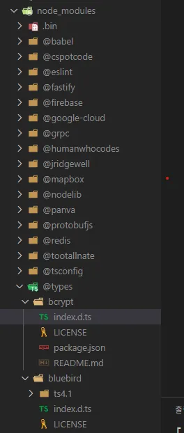
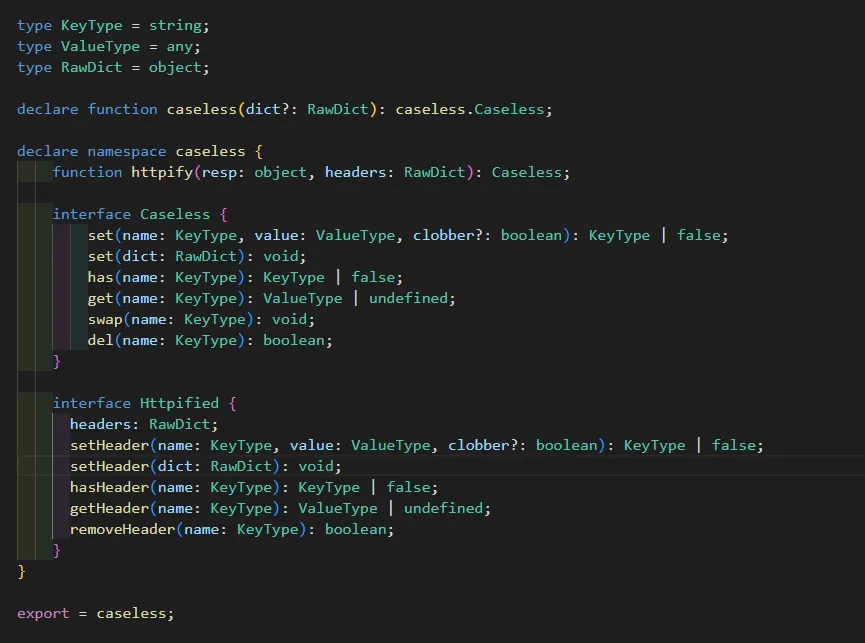
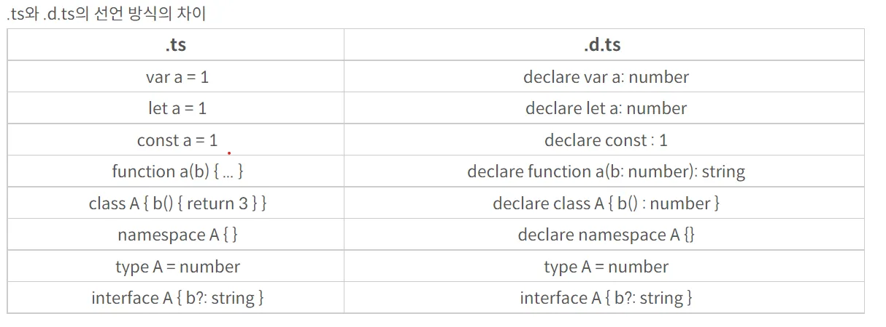

<small>노션으로 작성한 글을 옮긴 게시글입니다.</small>

## 모듈

### 타입스크립트의 모듈

- ES6+의 Modules 개념과 유사
- 전역변수와 구분되는 자체 유효 범위를 가지며,
export, import 와 같은 키워드를 사용해야만 다른 파일에서 접근할 수 있음

```ts
// math.ts
export interface Triangle {
  width: number;
  height: number;
}

// index.ts
import { Triangle } from './math.ts';

class SomeTriangle implements Triangle {
  // ...
}
```

### 모듈 코드 변환 방법

- tsconfig.json 파일에 설정한 컴파일러 모드에 따라 모듈 코드가 각기 다르게 변환됨

```ts
// SimpleModule.ts
import m = require("mod");
export let t = m.something + 1

// AMD / RequireJS SimpleModule.js 
define(["require", "exports", "./mod"], function (require, exports, mod_1) {
  exports.t = mod_1.something + 1;
});

// CommonJS / Node SimpleModule.js
var mod_1 = require("./mod");
exports.t = mod_1.something + 1;

// UMD SimpleModule.js
(function (factory) {
  if (typeof module === "object" && typeof module.exports === "object") {
    var v = factory(require, exports); if (v !== undefined) module.exports = v;
  }
  else if (typeof define === "function" && define.amd) {
    define(["require", "exports", "./mod"], factory);
  }
})(function (require, exports) {
  var mod_1 = require("./mod");
  exports.t = mod_1.something + 1;
});

// System SimpleModule.js
System.register(["./mod"], function(exports_1) {
  var mod_1;
  var t;
  return {
    setters:[
      function (mod_1_1) {
        mod_1 = mod_1_1;
      }],
    execute: function() {
      exports_1("t", t = mod_1.something + 1);
    }
  }
});
```

- 타입스크립트 컴파일 명령어를 통해 컴파일러 모드를 부여할 수 있음

```ts
# commonjs 모드인 경우
tsc --module commonjs Test.ts

# amd 모드인 경우
tsc --module amd Test.ts
```

## d.ts 파일

### 타입스크립트 선언 파일 (d.ts)

- 오직 타입을 선언하기 위해 존재하는 파일
- 기존 자바스크립트로 만들어진 외부 라이브러리 모듈들을
타입스크립트 환경에서도 쓸 수 있게 따로 타입만 정리해서 넣어둔 파일
- node_modules의 @types 폴더 안 모듈들에서 확인 가능





### 타입스크립트 선언 파일 만들기

- tsconfig 파일에 옵션을 주면 TS파일을 JS로 컴파일하는 과정에서
JS파일과 함께 d.ts 파일이 생성됨

```ts
"compilerOptions": {
	"allowJs": true, // js 파일 사용 허용여부
	"declaration": true // .d.ts 파일 생성여부
},
```

- 커스텀 타입을 사용하고 싶거나 타입스크립트를 지원하지 않는 라이브러리를 사용할 땐
직접 프로젝트 내에 .d.ts 파일 생성 가능
    - tsconfig의 compilerOptions에 typeRoots 속성 추가 (선언 파일이 들어갈 Root 설정)
    - typeRoots로 지정된 곳에 index.d.ts 파일 생성 가능
    - 필요에 따라 typeRoots 폴더 안에 모듈명 폴더를 추가로 만들어
    그 안에 index.d.ts 파일을 생성해도 됨



## 인덱싱

### 배열과 인덱싱

- 인터페이스를 사용하여 배열 인덱싱 타입을 정의할 수 있음

```ts
interface StringArray {
  [index: number]: string;
}
// 인덱스의 타입은 number, 이 인덱스로 요소 접근 시 해당 요소의 타입은 string

const arr: StringArray = ['Thor', 'Hulk'];
arr[0]; // 'Thor'
```

### 타입으로 배열 변경 제한하기

- 배열에 타입을 적용함과 동시에 배열 요소를 변경하지 못하게 하기

```ts
interface ReadonlyStringArray {
  readonly [index: number]: string;
}

const arr: ReadonlyStringArray = ['Thor', 'Hulk'];
arr[2] = 'Capt'; // Error!
```

## 참고 자료

[타입스크립트 핸드북](https://joshua1988.github.io/ts/intro.html)