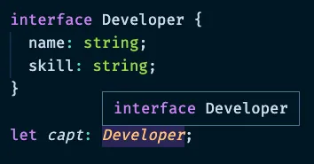

<small>노션으로 작성한 글을 옮긴 게시글입니다.</small>

## 타입 추론

### 타입 추론이란?

- 명시적인 타입 표기가 없을 때 타입스크립트에서 타입 정보를 추론하는 것
- 변수와 멤버를 초기화할 때, 매개변수 기본값을 설정할 때, 함수 반환 값을 설정할 때 발생

```ts
let x = 3; // let x: number
```

### 추론 방법 1. 최적 공통 타입 (Best Common Type)

- 여러 표현식을 바탕으로 타입을 추론할 때, 표현식의 타입들 중 가장 공통된 타입을 계산함
- 최적 공통 타입이 발견되지 않으면, 추론 결과는 유니온 배열 타입이 됨

```ts
let arr = [0, 1, null]; // let x: (number | null)[]

// arr의 타입을 추론하기 위해 각 배열 요소의 타입들을 고려함
// 각 후보 타입을 고려해서(여기서는 number, null) 다른 모든 후보와 호환되는 타입을 결정
```

- 모든 후보를 포함할 수 있는 상위 타입이 존재한다 해도,
해당 상위 타입이 후보 중에 없다면 선택될 수 없음
- 한 타입이 다른 모든 후보의 상위 타입이 아니라면, 유형을 명시적으로 제공할 것

```ts
// Rhino, Elephant, Snake 는 모두 Animal 을 상속받음

let zoo = [new Rhino(), new Elephant(), new Snake()];
// let zoo: (Rhino | Elephant | Snake)[]

let zoo = [new Animal(), new Rhino(), new Elephant(), new Snake()];
// let zoo: Animal[]

let zoo: Animal[] = [new Rhino(), new Elephant(), new Snake()];
// let zoo: Animal[]
```

### 추론 방법 2. 문맥상 타이핑 (****Contextual Typing****)

- 최적 공통 타입은 할당문 왼쪽 표현식의 타입이 오른쪽 표현식 타입에 의해 추론되었다면,
문맥상 타이핑은 반대로 오른쪽 표현식의 타입이 왼쪽 표현식 타입에 의해 추론됨
- 타입이 코드의 위치에 의해 문맥상으로 암시될 때 발생

```ts
window.onmousedown = function(mouseEvent) {
  console.log(mouseEvent.button);   //<- OK
  console.log(mouseEvent.kangaroo); //<- Error!
};

// Window.onmousedown 함수의 타입을 사용하여 오른쪽에 할당된 함수 표현식의 타입을 추론함
// 매개변수의 타입을 MouseEvent 로 추론하여, button 속성은 있지만 kangaroo 속성은 없다고 판단
```

```ts
window.onscroll = function(uiEvent) {
  console.log(uiEvent.button); //<- Error!
}

// uiEvent 의 타입이 MouseEvent가 아닌 UIEvent로 간주되어,
// button 은 없다고 판단하여 에러 발생
```

```ts
const handler = function(uiEvent) {
  console.log(uiEvent.button); //<- OK
}

// 여기선 문맥 판단이 어렵기 때문에 에러가 발생하지 않음
// 함수가 컨텍스트 타입 위치에 있지 않을 땐 인자가 암시적으로 any 타입을 가짐
// --noImplicitAny 옵션이 있다면 에러 발생
```

## 타입 호환

### 타입 호환이란?

- 타입스크립트 코드에서 특정 타입이 다른 타입에 잘 맞는지를 의미
- 구조적 타이핑 (aka.덕타이핑)

```ts
interface Ironman {
  name: string;
}

class Avengers {
  name: string;
}

let i: Ironman;
i = new Avengers(); // OK, because of structural typing
```

### 구조적 타이핑 예시

```ts
interface Avengers {
  name: string;
}

let hero: Avengers;
let capt = { name: "Captain", location: "Pangyo" };
hero = capt;

function assemble(a: Avengers) {
  console.log("Avengers assemble!!!", a.name);
}

assemble(capt);
```

### Enum 타입 호환

- 이넘 타입은 number 타입과 호환되지만 이넘 타입끼리는 호환되지 않음

```ts
enum Status { Ready, Waiting };
enum Color { Red, Blue, Green };

let status = Status.Ready;
status = Color.Red;  // Error
```

### Class 타입 호환

- 클래스 타입의 두 객체를 비교할 때, 오직 인스턴스의 멤버만 비교됨
- 스태틱 멤버와 생성자는 호환성에 영향을 주지 않음

```ts
class Animal {
  feet: number;
  constructor(feet: number) {
    this.feet = feet;
  }
  static pringFeet(): void {
    console.log('my feet!!');
  }
}

class Size {
  feet: number;
  static numFeet: number = 1;
  constructor(feet: number, noUseParam: number) {
    this.feet = feet;
  }
}

let a: Animal = new Animal(1);
let s: Size = new Size(1, 2);

a = s; // ok
s = a; // ok
```

### Generic 타입 호환

- 제네릭은 타입 인자 <T> 가 속성에 할당 되었는지를 기준으로 타입 호환 여부를 판단
- 타입 인자로 동일 타입을 넣거나 타입이 속성에 할당되지 않았다면 호환됨
- 타입 인자로 서로 다른 타입을 넣었다면 호환되지 않음

```ts
interface Empty<T> {}
let x: Empty<number> = {};
let y: Empty<string> = {};

x = y;  // OK
```

```ts
interface NotEmpty<T> {
  data: T;
}
let x: NotEmpty<number> = { data: 1 };
let y: NotEmpty<number> = { data: 2 };

x = y;  // OK
```

```ts
interface NotEmpty<T> {
  data: T;
}
let x: NotEmpty<number> = { data: 1 };
let y: NotEmpty<string> = { data: '2' };

x = y;  // Error
```

## 타입 별칭

### 타입 별칭 (Type Aliases)

- type 키워드를 사용, 특정 타입에 별칭을 부여할 수 있음
- 똑같은 타입을 한 번 이상 재사용하거나, 다른 이름으로 사용하고 싶을 때 쓰임

```ts
// 유니온 타입을 사용할 때
const name: string | number = 'capt';

// 타입 별칭을 사용할 때
type MyName = string | number;
const name: MyName = 'capt';
```

- 객체 타입, 제네릭과 같은 복잡한 타입에도 별칭 사용 가능

```ts
type Developer = {
  name: string;
  skill: string;
}

type User<T> = {
  name: T
}
```

### 타입 별칭의 특징

- 새로운 타입 값을 생성하는 것이 아닌, 정의한 타입에 대해 단지 별칭을 부여한 것 뿐
- 동일 타입에 대한 여러 버전을 만드는 것이 아님

```ts
type UserInputSanitizedString = string;
 
function sanitizeInput(str: string): UserInputSanitizedString {
  return sanitize(str);
}
 
// 보안 처리를 마친 입력을 생성
let userInput = sanitizeInput(getInput());
 
// 물론 새로운 문자열을 다시 대입할 수도 있음
userInput = "new input";
```

- VSCode 상의 프리뷰가 다르게 표시됨




### type VS interface

- 인터페이스가 가진 대부분의 기능을 타입 별칭에서도 동일하게 사용 가능
- 인터페이스는 오직 객체의 모양을 선언하는 데만 사용됨
    - 기존 원시 타입에 별칭을 부여하는 데에는 사용 불가
- 핵심적인 차이는 프로퍼티 추가 가능, 불가능 여부
    - 인터페이스는 항상 확장 가능하지만, 타입 별칭은 프로퍼티를 추가할 수 없음
    - 그러므로, 되도록 인터페이스로 선언하는 것이 좋음

```ts
// 인터페이스 확장
interface Animal {
  name: string
}

interface Bear extends Animal {
  honey: boolean
}

const bear = getBear()
bear.name
bear.honey

// 교집합을 통한 타입 확장
type Animal = {
  name: string
}

type Bear = Animal & {
  honey: Boolean
}

const bear = getBear();
bear.name;
bear.honey;
```

```ts
// 기존 인터페이스에 새 필드 추가
interface Window {
  title: string
}

interface Window {
  ts: TypeScriptAPI
}

const src = 'const a = "Hello World"';
window.ts.transpileModule(src, {});

// 타입은 생성된 뒤 변경 불가함
type Window = {
  title: string
}

type Window = { // Error: Duplicate identifier 'Window'
  ts: TypeScriptAPI
}
```


## 참고 자료

[타입스크립트 핸드북](https://joshua1988.github.io/ts/intro.html)