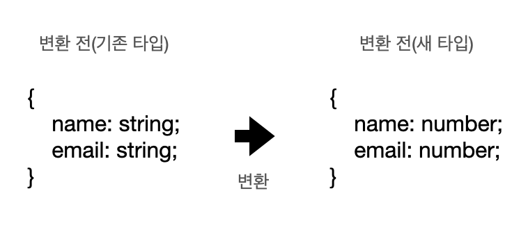

<small>노션으로 작성한 글을 옮긴 게시글입니다.</small>

## 유틸리티 타입

### 유틸리티 타입이란?

- 이미 정의해 놓은 타입을 변환할 때 사용하기 좋은 타입 문법
- 기존의 인터페이스, 제네릭 등의 기본 문법으로도 충분히 타입을 변환할 수 있지만
유틸리티 타입을 쓰면 훨씬 더 간결한 문법으로 타입을 정의할 수 있음

### 자주 사용되는 유틸리티 타입

- Partial<T>
	- T 타입의 부분집합을 만족하는 타입을 정의

```ts
interface Address {
	email: string;
	address: string;
}

type MayHaveEmail = Partial<Address>;
const me: MayHaveEmail = {}; // 가능
const you: MayHaveEmail = { email: 'test@abc.com' }; // 가능
const all: MayHaveEmail = { email: 'capt@hero.com', address: 'Pangyo' }; // 가능
```
        
- Pick<T, K>
	- T 타입에서 K 속성을 선택하여 정의

```ts
interface Hero {
	name: string;
	skill: string;
}

const human: Pick<Hero, 'name'> = {
	name: '스킬이 없는 사람',
};
```

```ts
interface Todo {
		title: string;
		description: string;
		completed: boolean;
}

type TodoPreview = Pick<Todo, 'title' | 'completed'>; // OK
type TodoPreview2 = Pick<Todo, 'date'>;
// error: '"date"' 형식이 'keyof Todo' 제약 조건을 만족하지 않습니다.

const todo: TodoPreview = {
		title: 'Clean room',
		completed: false,
};

const todo2: TodoPreview = {
		title: 'Clean room',
};
// error: 'completed' 속성이 '{ title: string; }' 형식에 없지만
// 'TodoPreview' 형식에서 필수입니다
```


- Omit <T, K>
	- T 타입에서 K 속성을 제거한 타입을 정의

```ts
interface AddressBook {
	name: string;
	phone: number;
	address: string;
	company: string;
}

const phoneBook: Omit<AddressBook, 'address'> = {
	name: '재택근무',
	phone: 12342223333,
	company: '내 방'
}

const chingtao: Omit<AddressBook, 'address'|'company'> = {
	name: '중국집',
	phone: 44455557777
}
```


### 여러가지 유틸리티 타입

[TypeScript 한글 문서](https://typescript-kr.github.io/pages/utility-types.html)

## 맵드 타입

### 맵드 타입(Mapped Type) 이란?

- 기존에 정의되어 있는 타입을 새로운 타입으로 변환해주는 문법
- 자바스크립트 map() 함수를 타입에 적용한 것과 같은 효과



### 맵드 타입의 기본 문법

```ts
{ [ P in K ] : T }
{ [ P in K ] ? : T }
{ readonly [ P in K ] : T }
{ readonly [ P in K ] ? : T }
```

### 기본 예제

- Heroes 타입의 세 이름에 각각 나이까지 붙인 객체를 만들고 싶을 때

```ts
type Heroes = 'Hulk' | 'Thor' | 'Capt';

type HeroProfiles = { [K in Heroes]: number };

const heroInfo: HeroProfiles = {
  Hulk: 54,
  Thor: 1000,
  Capt: 33,
}
```

- [K in Heroes] 부분은 자바스크립트의 for in 문법과 유사하게 동작함
- 앞서 정의된 세개의 문자열을 각각 순회하여 number 타입을 값으로 가지는 객체의 키로 정의함

```ts
{ Hulk: number } // 첫번째 순회
{ Thor: number } // 두번째 순회
{ Capt: number } // 세번째 순회
```

- 위의 원리가 적용된 HeroProfiles 의 타입은 아래와 같이 정의됨

```ts
type HeroProfiles = {
  Hulk: number;
  Thor: number;
  Capt: number;
}
```

### 실용 예제 (1)

- 객체를 정의하는 타입을 받아, 그 객체의 부분집합을 만족하는 타입으로 변환하기

```ts
type Subset<T> = {
  [K in keyof T]?: T[K];
}

interface Person {
  age: number;
  name: string;
}

const ageOnly: Subset<Person> = { age: 23 };
const nameOnly: Subset<Person> = { name: 'Tony' };
const ironman: Subset<Person> = { age: 23, name: 'Tony' };
const empty: Subset<Person> = {};

/*
Subset<Person> 타입은 아래와 동일함
{
  age?: number | undefined;
  name?: string | undefined;
}
*/
```

### 실용 예제(2)

- 사용자 프로필을 조회하는 API 함수

```ts
interface UserProfile {
  username: string;
  email: string;
  profilePhotoUrl: string;
}

function fetchUserProfile(): UserProfile {
  // ...
}
```

- 이 프로필의 정보를 수정하는 API

```ts
interface UserProfileUpdate {
  username?: string;
  email?: string;
  profilePhotoUrl?: string;
}

function updateUserProfile(params: UserProfileUpdate) {
  // ...
}
```

- 이 두 타입은 동일한 것이나 마찬가지이므로 반복해서 선언하는 것을 피해야 함

```ts
interface UserProfile {
  username: string;
  email: string;
  profilePhotoUrl: string;
}

interface UserProfileUpdate {
  username?: string;
  email?: string;
  profilePhotoUrl?: string;
}
```

- 반복되는 구조를 아래와 같이 재활용 가능

```ts
type UserProfileUpdate = {
  username?: UserProfile['username'];
  email?: UserProfile['email'];
  profilePhotoUrl?: UserProfile['profilePhotoUrl'];
}
```

- 이를 맵드 타입을 활용하여 코드를 줄일 수 있음

```ts
type UserProfileUpdate = {
  [p in 'username' | 'email' | 'profilePhotoUrl']?: UserProfile[p]
}
```

- 마지막으로, keyof 를 적용하면 완성

```ts
type UserProfileUpdate = {
  [p in keyof UserProfile]?: UserProfile[p]
}
```

## 참고 자료

[타입스크립트 핸드북](https://joshua1988.github.io/ts/intro.html)