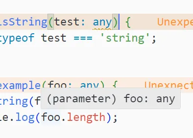
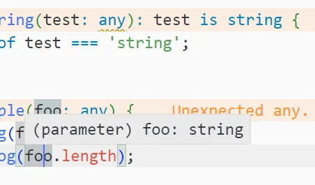

## 문제 상황

`number | string` 타입의 값을 가지는 countObject 객체의 값들 중에서, number 타입인 값들만 더하는 코드를 작성하던 중 다음과 같은 타입 오류가 발생했다.

<div class="code-header">
	<span class="red btn"></span>
	<span class="yellow btn"></span>
	<span class="green btn"></span>
</div>

```ts
const sum = Object.values(countObject)
	.filter((value) => typeof value === 'number')
  .reduce((acc, cur) => acc + cur, 0);
									//	  ~~~~~~~~~ Operator '+' cannot be applied to types
									//   'string | number' and 'number'
```

reduce 메서드를 사용하기 전에 이미 filter 메서드로 number 타입의 값들만 걸러냈기 때문에 reduce의 acc과 cur변수에는 무조건 number 타입의 값만 존재할텐데, 여전히 타입스크립트가 두 변수를 string일 수도 있다고 판단하는 것이 이해가 되지 않았다.

이러한 현상이 발생한 이유는 filter가 런타임에만 실행되는 메서드이기 때문에, 컴파일 타임에는 이 메서드가 숫자만 반환한다는 것을 알 수 없기 때문이다. 그러므로 filter를 거친 이후에도 filter를 거치기 전의 모든 타입을 유지하는 것이다.

이를 해결하기 위해 타입스크립트의 타입 가드 문법인 'is' 키워드를 사용할 수 있다.

## 해결 방법

<div class="code-header">
	<span class="red btn"></span>
	<span class="yellow btn"></span>
	<span class="green btn"></span>
</div>

```ts
sumOfCountsByPlatform[countByPlatform.platform] = Object.values(countByPlatform)
	.filter((value): value is number => typeof value === 'number')
	.reduce((acc, cur) => acc + cur, 0);
```

여기서 `(value): value is number` 부분이 바로 is 키워드를 사용한 부분이며,   
filter의 콜백함수가 반환하는 값(value) 이 number 라고 명시해 줌으로써 reduce에 들어가는 값이 오직 number 타입이란 것을 타입스크립트가 알게 했다.

## is 키워드

> 특정 함수의 리턴 타입에 is 키워드를 사용하면, 해당 함수를 거쳐서 나온 return 값이 true 일 때 변수의 타입을 좁힐수 있다.

<div class="code-header">
	<span class="red btn"></span>
	<span class="yellow btn"></span>
	<span class="green btn"></span>
</div>

```ts
function isString(test: any): test is string{
    return typeof test === "string";
}

function example(foo: any){
    if(isString(foo)){
        console.log(foo.length); // string
    }
}

example("hello world");
```

위 예시를 살펴봤을 때, isString 의 리턴 타입에 `test is string` 이라고 명시해 두었기 때문에 isString 함수를 호출한 범위 내에서 test 타입을 string으로 좁힐수 있는 것이다.



<div class="source">is 연산자 생략</div>



<div class="source">is 연산자 사용</div>

### as 키워드와 다른 점

타입을 좁혀준다는 점에서 as 키워드와 is 키워드는 비슷해 보이지만   
**as** 키워드는 **'이 변수는 이런 타입이야!'** 라고 하나의 변수에 대해 타입을 단언하는 것이라면,   
**is** 키워드는 **'이 함수의 매개변수에 대해 필터링을 거쳤으니 이 타입밖에 나올수 없어!'** 라고 알려주는 느낌이다.

## 참고 사이트

- [KwakKwakKwak.log - [타입스크립트] 'is', 'as' 문법 정리](https://velog.io/@kwak1539/%ED%83%80%EC%9E%85%EC%8A%A4%ED%81%AC%EB%A6%BD%ED%8A%B8-is-as-%EB%AC%B8%EB%B2%95-%EC%A0%95%EB%A6%AC)