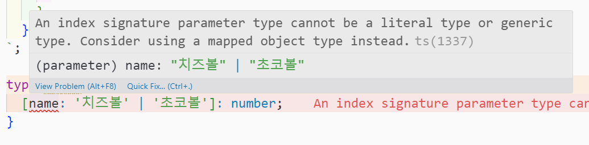
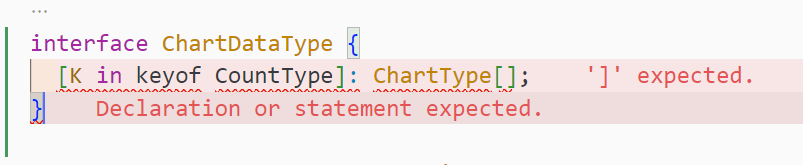

## 타입스크립트의 Record 란?

> **Record<Key, Value>** <br> 키가 Key타입이고 값이 Value 타입인 객체 타입을 생성함

타입스크립트의 유틸리티 타입 중 하나로, 인덱스 시그니처와 유사한 기능을 한다.

<div class="code-header">
	<span class="red btn"></span>
	<span class="yellow btn"></span>
	<span class="green btn"></span>
</div>


```ts
type Score = {
	[name: string]: number;
}

// Score와 동일한 역할
type ScoreRecord = Record<string, number>;


let scores: ScoreRecord = {
  '치즈볼': 100,
	'초코볼': 200,
};
```

Record가 인덱스 시그니처와 다른 점은, Key로 문자열 리터럴을 사용할 수 있다는 것이다.

```ts
// 인덱스 시그니처는 key 타입으로 문자열 리터럴 사용 불가
type Score = {
	[name: '치즈볼' | '초코볼']: number;
}
```



이는 Record 타입을 사용하면 되지만, 맵드 타입을 사용해서도 해결 가능하다.

```ts
type Names = '치즈볼' | '초코볼'

// 맵드 타입
type Score = {
	[name in Names]: number;
}

// Record 사용
type ScoreRecord = Record<Names, number>;


let scores: ScoreRecord = {
  '치즈볼': 100,
	'초코볼': 200,
};
```

## Record 타입 적용기

나는 타입스크립트로 프론트 개발을 하면서, 한 인터페이스의 키가 다른 타입에도 활용되는 경우가 매우 많았기 때문에 맵드 타입을 자주 썼다.

<div class="code-header">
	<span class="red btn"></span>
	<span class="yellow btn"></span>
	<span class="green btn"></span>
</div>

```ts
interface CountType {
	views?: number;
	likes?: number;
	shares?: number;
	comments?: number;
}

interface ChartType {
	axis: string;
	value: string;
	color: string;
}

const chartData: {
	[K in keyof CountType]: ChartType[]
} = {
  views: [...],
  likes: [...],
  shares: [...],
  comments: [...],
};
```

매번 위와 같이 사용하다가, chartData 에 해당하는 타입을 따로 정의하고 싶어서 맵드타입을 interface로 분리하려 했으나 맵드 타입을 사용해서만 인터페이스를 정의하는건 불가능했다.

```ts
interface ChartDataType {
	[K in keyof CountType]: ChartType[];
}
```



아래와 같이 인터페이스 안에 속성을 따로 지정해서 맵드 타입을 쓰는 것은 가능하다. 하지만 타입 적용 시 그 내부 속성으로 접근해야 한다는 단점이 있다.

```ts
interface ChartDataType {
	data: {
		[K in keyof CountType]: ChartType[];
	}
}

// 객체를 data속성으로 따로 감싸주거나
const chartData: ChartDataType = {
  data: {
		views: [],
		likes: [],
		shares: [],
		comments: []
	}
};

// 타입 적용 시 ['data']로 접근해야 함
const chartData2: ChartDataType['data'] = {
  views: [],
  likes: [],
  shares: [],
  comments: [],
};
```


아래와 같이 type 키워드로 정의해두면 간단히 해결되지만, 한 프로젝트 내에서는 type과 interface 중에 하나로 통일해서 사용하는것이 좋다고 했고 우리 팀은 이미 interface를 사용중이었기 때문에 type 키워드를 쓰고 싶지는 않았다.

```ts
type ChartDataType = {
	[K in keyof CountType]: ChartType[];
}
```

그렇게 해서 찾아낸 타입이 Record 타입이다.

<div class="code-header">
	<span class="red btn"></span>
	<span class="yellow btn"></span>
	<span class="green btn"></span>
</div>

```ts
// 이전 코드
const chartData: {
	[K in keyof CountType]: ChartType[]
} = {
  views: [...],
  likes: [...],
  shares: [...],
  comments: [...],
};

// Record 사용
const chartData: Record<keyof CountType, ChartType[]> = {
  views: [...],
  likes: [...],
  shares: [...],
  comments: [...],
};
```

타입 정보를 따로 정의한 것은 아니지만, 타입 분리를 하려 했던 취지가 코드를 더 깔끔하게 만들기 위함이었어서, Record 타입을 써서 이전보다 코드가 깔끔해 진 것에 만족하였다.

Record 타입도 type 키워드를 쓰면 따로 정의가 가능하다.

<div class="code-header">
	<span class="red btn"></span>
	<span class="yellow btn"></span>
	<span class="green btn"></span>
</div>

```ts
type ChartDataType = Record<keyof CountType, ChartType[]>;

const chartData: ChartDataType = {
  views: [],
  likes: [],
  shares: [],
  comments: [],
};
```

---


## 참고 링크

- [DevStory - [TypeScript]Record Type 사용 방법](https://developer-talk.tistory.com/296)