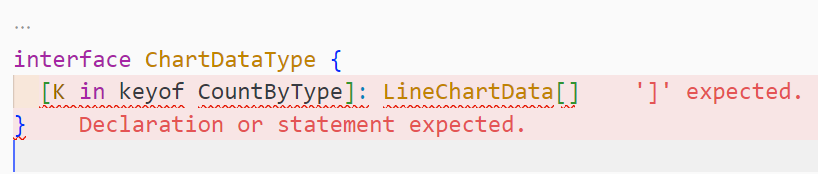

## 타입스크립트의 Record 란?

> **Record<Key, Value>** <br> 키가 Key타입이고 값이 Value 타입인 객체 타입을 생성함

타입스크립트의 유틸리티 타입 중 하나로, 인덱스 시그니처와 유사한 기능을 한다.

<div class="code-header">
	<span class="red btn"></span>
	<span class="yellow btn"></span>
	<span class="green btn"></span>
</div>


```ts
type Score = {
	[name: string]: number;
}

// Score와 동일한 역할
type ScoreRecord = Record<string, number>;


let scores: ScoreRecord = {
  '치즈볼': 100,
	'초코볼': 200,
};
```

Record가 인덱스 시그니처와 다른 점은, Key로 문자열 리터럴을 사용할 수 있다는 것이다.

```ts
// 인덱스 시그니처는 key 타입으로 문자열 리터럴 사용 불가
type Score = {
	[name: '치즈볼' | '초코볼']: number;
}
```


이는 Record 타입을 사용하면 되지만, 맵드 타입을 사용해서도 해결 가능하다.

```ts
type Names = '치즈볼' | '초코볼'

// 맵드 타입
type Score = {
	[name in Names]: number;
}

// Record 사용
type ScoreRecord = Record<Names, number>;


let scores: ScoreRecord = {
  '치즈볼': 100,
	'초코볼': 200,
};
```

## Record 타입 적용기

나는 타입스크립트로 프론트 개발을 하면서, 한 인터페이스의 키가 다른 타입에도 활용되는 경우가 매우 많았기 때문에 맵드 타입을 자주 썼다.

<div class="code-header">
	<span class="red btn"></span>
	<span class="yellow btn"></span>
	<span class="green btn"></span>
</div>

```ts
interface CountType {
	views?: number;
	likes?: number;
	shares?: number;
	comments?: number;
}

interface ChartType {
	axis: string;
	value: string;
	color: string;
}

const chartData: {
	[K in keyof CountType]: ChartType[]
} = {
  views: [...],
  likes: [...],
  shares: [...],
  comments: [...],
};
```

매번 위와 같이 사용하다가, chartData 에 해당하는 타입을 따로 분리해서 정의하고 싶어서 맵드타입을 interface로 분리하려 했으나 맵드 타입을 사용해서만 인터페이스를 정의하는건 불가능했다.



Record 타입

<div class="code-header">
	<span class="red btn"></span>
	<span class="yellow btn"></span>
	<span class="green btn"></span>
</div>

```ts
const chartData: Record<keyof CountType, ChartType[]> = {
  views: [...],
  likes: [...],
  shares: [...],
  comments: [...],
};
```

타입 분리 - type 키워드만 가능, interface는 불가

<div class="code-header">
	<span class="red btn"></span>
	<span class="yellow btn"></span>
	<span class="green btn"></span>
</div>

```ts
// 이렇게는 사용 불가
interface ChartDataType {
	[K in keyof CountType]: ChartType[]
}

// 이렇게 하려면 추가 속성 정의 필요
interface ChartDataType extends Record<keyof CountType, ChartType[]> {}
```

## 참고 링크

- [DevStory - [TypeScript]Record Type 사용 방법](https://developer-talk.tistory.com/296)