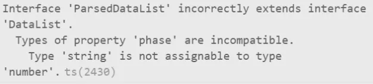

## 인터페이스 속성 재정의

타입스크립트 개발 도중, 이미 존재하는 인터페이스를 상속받고 몇몇 속성의 타입만 재정의(override) 하고싶은 상황이 생겼다.

<div class="code-header">
	<span class="red btn"></span>
	<span class="yellow btn"></span>
	<span class="green btn"></span>
</div>

```ts
interface DataList {
	phase: number;
	name: string;
	follower: number;
	url: string;
	view: number;
	like: number;
	comments: number;
	share: number;
}

interface ParsedDataList {
	phase: string;
	name: string;
	follower: string;
	url: string;
	view: number;
	like: number;
	comments: number;
	share: number;
}
```

여기서 ParsedDataList 는 DataList 와 다음 두가지 속성의 타입을 제외하고는 모두 동일하다.

```txt
phase: number -> string
follower: number -> string
```

ParsedDataList 인터페이스가 DataList 를 상속받게 한 다음, phase와 follower 속성만 따로 재정의하려고 했으나, 타입 에러가 발생했다.

<div class="code-header">
	<span class="red btn"></span>
	<span class="yellow btn"></span>
	<span class="green btn"></span>
</div>

```ts
interface ParsedDataList extends DataList {
	phase: string;
	follower: string;
}
```



위와 같은 방식으로 속성을 재정의 하려면, 아예 다른 타입으로 매핑할 수는 없고 더 구체적인 하위 집합으로 좁히는 것만 가능하다.

<div class="code-header">
	<span class="red btn"></span>
	<span class="yellow btn"></span>
	<span class="green btn"></span>
</div>

```ts
interface NullableExample {
  name: string | null;
}

interface NonNullableExample extends NullableExample {
  name: string;
}
```

아예 다른 타입으로 변경하려면 다음과 같이 유틸리티 타입중 하나인 Omit 을 사용해서, 변경할 속성만 제거한 인터페이스를 상속받고 재정의 해야한다.

<div class="code-header">
	<span class="red btn"></span>
	<span class="yellow btn"></span>
	<span class="green btn"></span>
</div>

```ts
interface ParsedDataList extends Omit<DataList, 'phase' | 'follower'> {
	phase: string;
	follower: number;
}
```

## Omit

> 기존 타입에서 특정 속성만 제거한 타입을 정의한다. (Pick의 반대)

<div class="code-header">
	<span class="red btn"></span>
	<span class="yellow btn"></span>
	<span class="green btn"></span>
</div>

```ts
interface Product {
  id: number;
  name: string;
  price: number;
  brand: string;
  stock: number;
}

type shoppingItem = Omit<Product, "stock">;

const apple: Omit<Product, "stock"> = {
  id: 1,
  name: "red apple",
  price: 1000,
  brand: "del"
};
```

여러 타입을 제거하고 싶을 땐 유니온 타입 `|` 을 사용한다.

<div class="code-header">
	<span class="red btn"></span>
	<span class="yellow btn"></span>
	<span class="green btn"></span>
</div>

```ts
const apple: Omit<Product, "stock" | "brand"> = {
  id: 1,
  name: "red apple",
  price: 1000,
};
```

## 참고 사이트

- [기억보다 기록을 - 유틸리티 타입](https://kyounghwan01.github.io/blog/TS/fundamentals/utility-types/#omit)
- [SY Storage - [Typescript] typescript에서 type과 interface의 속성을 재정의하는 방법 (typescript Overriding)](https://systorage.tistory.com/entry/Typescript-typescript%EC%97%90%EC%84%9C-type%EA%B3%BC-interface%EC%9D%98-%EC%86%8D%EC%84%B1%EC%9D%84-%EC%9E%AC%EC%A0%95%EC%9D%98%ED%95%98%EB%8A%94-%EB%B0%A9%EB%B2%95-typescript-Overriding)
- [chamdom.blog - TypeScript: 인터페이스(Interface)](https://chamdom.blog/ts-interface/)